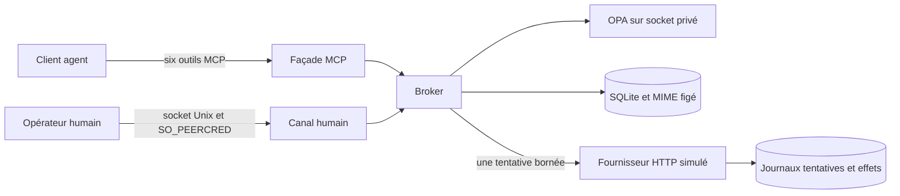

# Architecture actuelle

Moraine sépare la proposition d'une action de son autorisation et de son
exécution. Le pilote actif est sous `pilots/codex_email/`; il dérive du prototype
OPA B, sans importer les modules de `experiments/`. Les
[interfaces détaillées](pilot/interface.md) et la [provenance](pilot/provenance.md)
complètent cette vue.

## Chemins d'exécution

La façade MCP authentifie le bearer et fournit `request_access`, `get_access`,
`list_context`, `read_context`, `propose_reply`, `get_request`. Le canal humain peut créer ou
révoquer une délégation, consulter la revue exacte et décider. L'identité vient
du transport/configuration, jamais d'un champ d'autorité fourni par l'agent.

| Responsabilité | Sources |
| --- | --- |
| Cycle métier, droits, snapshots, SQLite, intention durable et reprise | [broker.py](../pilots/codex_email/src/moraine_email/broker.py) |
| Validation et MIME préparé une seule fois | [models.py](../pilots/codex_email/src/moraine_email/models.py), [mime.py](../pilots/codex_email/src/moraine_email/mime.py) |
| Processus OPA et décisions Rego sans fallback permissif | [policy.py](../pilots/codex_email/src/moraine_email/policy.py), [politiques](../pilots/codex_email/src/moraine_email/policy/) |
| Façade agent | [mcp_server.py](../pilots/codex_email/src/moraine_email/mcp_server.py) |
| Canal et terminal humains | [human_server.py](../pilots/codex_email/src/moraine_email/human_server.py), [human_cli.py](../pilots/codex_email/src/moraine_email/human_cli.py) |
| Lancement, configuration et surveillance | [server.py](../pilots/codex_email/src/moraine_email/server.py) |
| Tentative fournisseur sans retry | [simulated.py](../pilots/codex_email/src/moraine_email/adapters/simulated.py) |
| Observation indépendante des tentatives et effets | [provider_server.py](../pilots/codex_email/tests/fixtures/provider_server.py) |

## Données et invariants

Une délégation lie agent, boîte, durée et liste fermée de ressources. Son type
explicite est `context_read` ou `reply`; seul le second fixe un destinataire
et une cible de réponse. Un accès de lecture ne permet aucune proposition d'envoi.
La sélection est immuable : 1 à 5 messages, éventuellement une note. Le broker
contrôle chaque lecture et ne déduit pas un droit du contenu des messages.
L'[ingestion proposée](plans/email-ingestion-contract.md) n'est pas implémentée :
le chemin historique reçoit les textes par le canal humain. Le nouveau
[parcours d'accès](pilot/agent-access.md) récupère des objets JSON fictifs par
HTTP après accord humain; il ne qualifie pas l'ingestion de messages réels.

`request_access` enregistre un périmètre de lecture figé dans `access_requests`.
L'accord est conservé avant la récupération; le grant, les captures et la
disponibilité sont publiés atomiquement. Un échec laisse l'accord enregistré,
sans grant. `get_access` retrouve la demande et l'accès de l'identité configurée
par un nom public de sélection, y compris dans une nouvelle conversation.
La consultation ne provoque aucune récupération. Au redémarrage, une capture
interrompue devient un échec et n'est jamais relancée automatiquement.

SQLite utilise désormais la version 2. Les anciennes bases ne sont pas migrées
automatiquement; les preuves et runtimes historiques doivent être conservés.

Une proposition référence un grant et un message sélectionné, avec une clé
d'idempotence et un corps texte. Le broker prépare et conserve les octets MIME,
leur aperçu, le contexte versionné et l'empreinte de l'action. La revue émet un
nonce; la décision doit correspondre à ce nonce et à ce digest. Les octets envoyés
sont ceux qui ont été revus, sans reconstruction depuis un texte modifié.

SQLite conserve grants, ressources, requêtes, décisions, intentions d'exécution
et résolutions. Un broker possède l'état; les opérations sont sérialisées. Une
intention est durable avant IO. Droits et échéances sont revérifiés avant la
tentative. La révocation ne rappelle pas une requête déjà partie.

| État persisté | Sens |
| --- | --- |
| `pending` | Proposition figée en attente de décision |
| `processing` | Intention d'exécution persistée, résultat non final |
| `rejected` | Refus humain, aucun envoi pour cette décision |
| `denied` | Délégation ou conditions d'autorisation insuffisantes |
| `accepted` | Acceptation déclarée par le fournisseur; livraison `unverified` |
| `failed` | Échec certain selon le cas traité |
| `unknown` | Effet incertain; aucune relance automatique |

La projection API expose l'état interne `processing` comme
`unknown/unresolved_dispatch_intent`, sans snapshot. Une demande peut rester
`pending` tout en ne présentant qu'un reçu : l'aperçu et le digest sont retirés
après échéance de revue ou, pour l'agent, après perte d'autorisation ou changement
de révision de politique. Voir le [contrat d'interface](pilot/interface.md).

Une clé identique et une demande identique retrouvent le même résultat; changer
le contenu sous la même clé est un conflit. Une intention non résolue ou un
`unknown` bloque aussi les autres demandes pour le même compte/message source,
même sous une nouvelle clé ou délégation. Cette barrière survit au redémarrage;
sa résolution exige une opération humaine explicite reconnaissant le risque
de doublon. Après révocation/expiration, un reçu terminal reste vrai mais son
contenu sensible est retiré de la projection agent.

## Laboratoire et qualification

Le [laboratoire](pilot/local-lab.md) ajoute une console opérateur locale,
une supervision de processus et des scénarios. Le navigateur utilise un jeton
opérateur propre. Le serveur du lab agit sur les vrais transports MCP et Unix;
il lit les effets enregistrés indépendamment pour construire la boîte reçue.
Les tests du lab emploient le même broker et la même politique que le pilote.

L'opérateur de lab peut jouer les deux rôles; l'assistant peut le manipuler dans
son navigateur. Cette surface de test n'est pas une nouvelle permission MCP
pour l'agent. Le label « Assistant IA » décrit l'intervention dans la session,
sans lancer un modèle. Les scénarios automatiques restent scriptés.

Le [banc d'inspection](qualification/email-inspection.md) est séparé : corpus
fictif, fichiers de prédictions fournis, validateurs et calculs. Il ne participe
pas au chemin d'envoi et n'est ni un filtre entrant ni un runner de modèle.

Le [runbook Linux](pilot/linux-deployment.md) décrit une installation séparée à
qualifier. Les preuves actuelles sous un utilisateur Linux couvrent les règles
applicatives et les protocoles, pas le confinement d'un agent qui peut lire les
fichiers de ce même utilisateur.
