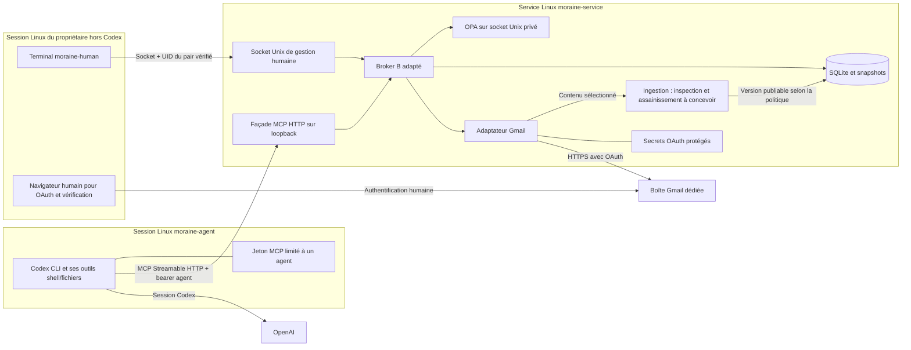

# Pilote email Moraine depuis Codex

Date : 20 septembre 2026. Statut : **choix de Codex CLI sous identité Linux dédiée accepté; étapes 1–2 implémentées et validées localement sur fournisseur simulé**. Le dépôt a été initialisé et l'existant commité avant développement (`5feab54`). Voir le [rapport de développement](../../pilot-results/codex-email/20260920-steps-1-2/REPORT.md). Installation système, configuration Codex/comptes et envois réels restent des étapes ultérieures. Mission : [plan-codex-mcp-email.md](../prompts/plan-codex-mcp-email.md).

## 1. Recommandation et résultat recherché

Conserver **B, broker indépendant avec OPA et SQLite**, et lui ajouter une façade MCP étroite et un adaptateur Gmail API. Premier client : **Codex CLI sous un utilisateur Linux dédié**. Le propriétaire sélectionne le contexte et approuve dans un terminal de sa propre session Linux, hors des outils de Codex. Le fournisseur simulé sert d'abord à démontrer tout le parcours; une boîte Gmail dédiée remplace ensuite la simulation.

Premier usage : préparer une réponse utile à un message sélectionné, à un seul correspondant autorisé, en texte simple UTF-8, sans pièce jointe sortante. L'humain voit le message exact, approuve ou refuse; Codex consulte ensuite le résultat. Toutes les réponses nécessitent une approbation. Pas de boîte principale, d'envoi automatique, de recherche libre dans la messagerie ou de framework de connecteurs.

**Cadrage retenu le 20 septembre 2026 :** prévoir une couche d'inspection et d'assainissement entre la récupération du contenu sélectionné et sa publication à l'agent (§ 6), avec Prompt Guard comme l'une de ses briques de détection. L'implémentation, la variante/version de Prompt Guard, les autres bibliothèques et l'emploi éventuel d'un inspecteur génératif restent à qualifier. Les validations enregistrées des étapes 1–2 ne couvrent pas cette nouvelle couche.

**Critère de réussite réel :** depuis Codex, une réponse préparée à partir de 1 à 5 messages sélectionnés atteint un correspondant de test consentant; son adresse et son contenu décodé correspondent au snapshot approuvé. Une répétition de soumission/approbation et un redémarrage n'ajoutent aucun envoi. Un refus humain et une tentative de lecture hors sélection produisent respectivement zéro effet et zéro lecture protégée. L'humain distingue une acceptation par Gmail d'une livraison constatée. Ces observations seront des preuves de pilote, pas une certification.

La séparation Linux a été acceptée par l'utilisateur (§ 10), qui demande également des subagents et des reviewers. Gmail, la sélection explicite et les limites ci-dessous restent des hypothèses de travail.

## 2. Base vérifiée et portée des preuves

Constat lors de la planification initiale : racine documentaire retenue `docs`; aucun dépôt Git utilisable ni `docs/AGENTS.md` n'était présent. La présence d'un répertoire `.git` ne suffisait pas à établir un dépôt. Le dépôt a depuis été initialisé à la demande de l'utilisateur; la racine documentaire reste `docs`.

Documents lus dans l'ordre de la mission : [comparaison](../experiments/COMPARISON.md), [contrat expérimental](../experiments/EXPERIMENT.md), [implémentation B](../experiments/B-implementation.md), [README B](../../experiments/b_broker/README.md), [résumé final](../../experiments/results/final-summary.json), [campagne finale](../../experiments/results/final-campaign/report.json), [revue B](../experiments/reviews/B-review.md), puis sources et preuves ciblées.

- Résultats **enregistrés**, non réexécutés pendant cette planification : 30 scénarios communs réussis par approche; 115 tests locaux au total. Pour B : 17 tests Python et 12 Rego; la campagne finale comporte 30 réussites, 16 effets et 14 lectures. Ils concernent des identités et fournisseurs synthétiques avec moteurs réels.
- Vérification actuelle par SHA-256 : les 18 fichiers sous `experiments/b_broker/` du [manifest après correction](../../experiments/b_broker/evidence/post-review-source-manifest.json) correspondent; les 20 fichiers sélectionnés dans le manifest de la campagne finale — B, fournisseur commun et runner — correspondent aussi. Le broker lu a l'empreinte `83a5e2986ba4681ca78fee0d9679355022617966c66cd5d3bf4da5fc2c7ea292`.
- B-R1 est un **défaut initial corrigé** : expiration pendant l'attente SQLite avant l'effet. [Reproduction avant correction](../../experiments/results/review-b/reproduction.json), [quatre régressions après correction](../../experiments/b_broker/evidence/post-review-regressions.log), [suite complète corrigée](../../experiments/b_broker/evidence/post-review-local-tests.log). `execute()` recontrôle désormais les échéances après le commit de l'intention, juste avant l'IO.
- B-R2 concernait l'oracle fournisseur : mutation malgré un `/control` rejeté. Le code actuel valide avant mutation; les [contrôles finaux indépendants](../../experiments/results/final-local-checks/results.json) documentent la correction. Les preuves pré-correction restent historiques.
- La revue A interrompue par un filtre automatique puis complétée par le coordinateur est signalée dans la comparaison; elle ne devient pas une revue indépendante intégralement exécutée. A et C restent des références, sans réouverture de leur comparaison.

La préférence historique pour A auprès de développeurs Python ne contredit pas ce mandat : la direction retenue ici est un service appelé depuis Codex. Aucun obstacle observé ne justifie de remplacer B. La [recherche antérieure](../research/delegated-authority-investigation.md) conserve sa conclusion : la valeur d'une nouvelle bibliothèque générique reste à démontrer.

## 3. Parcours du premier usage

| Étape | Lecture et demande de l'agent | Décision humaine | Exécution effective |
|---|---|---|---|
| Préparer la boîte | Aucun accès fournisseur | Choisir une boîte dédiée et un correspondant de test; n'y placer que du contenu acceptable pour le pilote | Configuration OAuth hors Codex, après autorisation de l'étape réelle |
| Choisir le contexte | Rien tant que la délégation n'existe pas | Dans `moraine-human`, sélectionner 1 à 5 messages, éventuellement une note texte locale; choisir le message auquel répondre, l'adresse exacte permise et une échéance | Le service inventorie pour l'humain, importe seulement les corps sélectionnés, applique la future inspection/assainissement et fige les versions publiables; aucun fil entier implicitement inclus |
| Déléguer | Recevoir un `grant_id`, qui n'est pas un secret ni une autorisation autonome | Confirmer agent, boîte, liste fermée de ressources, destinataire et durée | Le service crée la délégation liée à l'identité agent authentifiée; validité proposée : 30 minutes |
| Demander une réponse | Lister la sélection puis lire ses seuls textes; demander une réponse à `reply_to_ref` | Donner l'objectif rédactionnel dans Codex | Codex prépare un corps; le service contrôle et normalise, puis conserve le message exact |
| Soumettre | `propose_reply` retourne immédiatement après préparation un `request_id`, une empreinte et `pending` | Aucun consentement déduit du prompt | Aucune tentative d'envoi; pas d'appel MCP suspendu pendant la revue |
| Revoir | Consulter `pending`; aucune méthode pour approuver | Dans le terminal humain, consulter le snapshot complet, approuver ou refuser cette demande précise | Approver : recontrôles puis une tentative d'envoi; refuser : état terminal sans envoi |
| Constater | `get_request` retourne l'état durable et sa signification | Vérifier la réception au premier essai réel; investiguer un `unknown` | L'acceptation fournisseur et l'observation du destinataire sont deux preuves distinctes |
| Terminer | Les lectures ultérieures refusent après révocation/expiration | Révoquer la délégation; éventuellement révoquer OAuth | Plus de nouvel accès protégé ni d'envoi; ce qui a déjà été communiqué au modèle ne peut être effacé par révocation |

**Démonstration simulée :** mêmes outils, mêmes règles, même canal humain et même rendu; données fictives et effets dans un journal de fournisseur observé indépendamment. Présenter explicitement « simulé ». La séparation OS n'est revendiquée qu'après son étape de validation.

**Usage réel :** les identifiants Gmail et l'absence de connecteur parallèle sont vérifiés; un message simple préalablement convenu sert de premier envoi. Le chemin normal ne comporte aucune pièce jointe. Les documents optionnels sont des notes `.txt` importées pour la lecture, pas des fichiers à envoyer. Les tests hérités de pièces jointes restent conservés dans l'expérience, sans annoncer cette fonctionnalité dans le pilote.

Une correction du texte après soumission crée une nouvelle demande et une nouvelle approbation. Le canal humain peut refuser l'ancienne demande; ni l'agent ni l'humain ne modifient le snapshot en place.

## 4. Composants, identités et pouvoirs

### Déploiement minimal proposé

Les noms Linux sont proposés, pas créés. Trois domaines de confiance : agent non privilégié, service détenteur des droits fournisseur, humain habilité à les déléguer. Le noyau, l'administrateur de la machine et le binaire déployé du service restent fiables dans ce modèle.

Le module d'ingestion représente ici le contrôle de publication du contenu. L'éventuel inspecteur IA n'est pas assimilé au service privilégié dans ce schéma : son exécution, son isolation et l'usage de ses résultats restent à concevoir (§ 6).

| Élément | Propriétaire et accès proposés | Protection à vérifier |
|---|---|---|
| Codex et son home | `moraine-agent`; propres fichiers, authentification Codex et jeton MCP agent | Aucun `sudo`, groupe administrateur, socket Docker, clé SSH privilégiée ou montage du home humain |
| Code exécuté, politiques, dépendances | Installation figée sous `/opt/moraine-pilot`, propriétaire administrateur | Ni `moraine-agent` ni le compte service ne modifient code/politiques; ne pas lancer le service depuis le workspace modifiable par Codex |
| État | `/var/lib/moraine-pilot`, service seul, répertoire `0700`, fichiers `0600` | SQLite, WAL/SHM, blobs et sauvegardes interdits à l'agent; un seul broker propriétaire |
| Secrets fournisseur | Répertoire privé du service ou fichiers de credentials remis au service par le superviseur | Aucun secret dans arguments de processus, dépôt, logs, sortie MCP ou environnement de Codex; refresh token renouvelé de façon atomique |
| OPA | Enfant supervisé, socket et token privés sous `/run/moraine-pilot/opa/` | Même frontière fiable que B; API d'administration non publiée; arrêt du groupe de processus |
| Gestion humaine | Socket `/run/moraine-pilot/human.sock`, groupe humain dédié, permissions `0660` | Vérifier l'UID effectif du pair avec `SO_PEERCRED` et une table d'habilitation; jamais un champ `human` envoyé par le client |
| Façade agent | `127.0.0.1:<port>/mcp`, bearer dédié, audience Moraine | Seulement les quatre outils du § 5; autres routes absentes; authentification indépendante de la seule provenance loopback |

Linux permet de récupérer les credentials du pair sur un socket Unix et applique les permissions aux sockets nommés; l'implémentation devra tester les deux contrôles. [Source Linux](https://man7.org/linux/man-pages/man7/unix.7.html)

Le jeton MCP est **considéré lisible par l'agent**, y compris depuis son shell. Il autorise uniquement cet agent à lister/lire le contexte délégué, proposer une réponse et consulter ses demandes. Il ne crée ni délégation, ni approbation, ni identité fournisseur. Jeton aléatoire, stocké sous forme d'empreinte côté service, révocable et limité à une session de pilote (durée maximale proposée : une journée); délégations plus courtes. Sa rotation ne réactive aucune délégation révoquée.

### Pourquoi un autre processus ne suffit pas

| Option | Propriété et coût | Choix |
|---|---|---|
| Utilisateurs Linux distincts, Codex CLI dédié, gestion humaine locale | Le noyau sépare fichiers/processus et l'identité du pair; demande une installation administrateur et l'absence de pont vers la session humaine | **Défaut** : le plus petit déploiement local qui peut protéger les deux pouvoirs, sous ces hypothèses |
| VM dédiée à Codex, service et approbation hors VM | Frontière plus explicite, mais réseau, certificats et échange du workspace à organiser; pas de dossiers/secrets/sockets hôte partagés | Repli si le client choisi expose des outils de l'hôte impossibles à isoler |

Un processus supplémentaire sous l'utilisateur courant reste uniquement une démo fonctionnelle. Un conteneur donnant accès au home, à Docker ou au navigateur humain ne résout pas le problème non plus.

**Shell et fichiers :** l'agent peut appeler directement le listener MCP ou fabriquer des requêtes HTTP, mais rencontre exactement les mêmes contrôles. Il ne peut ni lire le refresh token ni modifier les politiques, l'état ou l'exécutable actif. Tester `/proc`, liens symboliques, permissions des répertoires parents et accès aux sockets avec l'identité réellement utilisée, sans se contenter de lire les modes Unix.

**Navigateur :** aucun navigateur contrôlable par Codex ne doit porter une session Gmail de la boîte dédiée ou une session d'administration Moraine. Aucun pont CUA, D-Bus, X11/Wayland, keyring, agent SSH ou contrôle distant vers la session humaine. Le pilote CLI n'installe pas de connecteur Gmail/Outlook parallèle; inspecter aussi les outils distants liés au compte Codex, pas seulement les plugins locaux. Si une capacité équivalente reste accessible, l'essai réel est bloqué jusqu'à son retrait ou son confinement. Une simple consigne au modèle ne remplace pas ce contrôle.

**Réseau :** l'agent rejoint OpenAI et le MCP local; B rejoint Gmail et le point OAuth via HTTPS validé; OPA et gestion humaine utilisent des sockets locaux. Les URL fournisseur sont fixées par configuration fiable, sans URL ni proxy fournis par l'agent, sans redirection d'envoi et sans `trust_env`. Pour le pilote local, on ne promet pas une impossibilité d'ouvrir une connexion TCP vers Google : on protège l'**accès authentifié à la boîte** par l'absence de credentials et de sessions alternatives. Bloquer tout réseau hors allowlist serait une exigence supplémentaire, pas une propriété prouvée ici. Le trafic MCP reste local; tout déplacement sur une autre machine imposera TLS et une nouvelle validation du déploiement.

### Canal humain et liaison de l'approbation

La connexion à la session Linux humaine constitue l'authentification de départ. `moraine-human` utilise le socket réservé; B associe l'UID du pair à l'unique propriétaire de boîte. L'outil installé est fiable et indépendant du workspace agent. Il doit être lancé dans un terminal non exposé à Codex.

`review <request_id>` charge directement le snapshot du service et affiche : boîte expéditrice, agent/délégation, message d'origine, adresse To complète, Cc/Bcc vides, sujet, corps intégral, absence de pièces jointes, empreinte, dates et échéance. Rendu texte inerte : caractères de contrôle/échappements terminal neutralisés, caractères ambigus signalés, pas de HTML actif, lien ouvrable automatiquement, commande interpolée ou pager exécutable. Aucun tronquage silencieux; une vue incomplète ne permet pas d'approuver.

Après lecture, une confirmation interactive liée à cette vue envoie seulement `request_id`, `action_digest`, un nonce de revue à usage unique et la décision. Le service vérifie l'UID, la correspondance, le statut, la délégation et les échéances, et persiste la décision. Le nonce expire au plus tard avec la revue et n'est jamais renvoyé par MCP. Le digest seul n'est pas un secret et ne prouve pas l'origine humaine.

Conserver les bornes de B : revue au maximum 300 secondes après préparation, consentement au maximum 60 secondes et toujours borné par la revue et la délégation. Si elles s'avèrent trop courtes, mesurer avant de changer ces règles. `approved=true`, un texte « oui » produit par le modèle et les confirmations propres à Codex n'ont aucun pouvoir côté Moraine. Aucune route humaine n'est exposée comme outil MCP.

## 5. Contrat minimal MCP et correspondance avec B

La documentation officielle vérifie que Codex CLI prend en charge STDIO et Streamable HTTP, et permet un bearer HTTP provenant d'une variable d'environnement. **Streamable HTTP sur loopback** est retenu : B vit et conserve ses demandes indépendamment du processus Codex; aucun sous-processus lancé par l'agent ne doit recevoir les secrets du service. STDIO resterait possible avec un simple relais non privilégié, mais ajouterait un composant inutile ici. L'intégration future déclarera l'URL `/mcp` et `bearer_token_env_var` dans le profil dédié. Aucune configuration n'est modifiée par cette mission. [Documentation OpenAI MCP](https://learn.chatgpt.com/docs/extend/mcp?surface=cli)

Employer une bibliothèque MCP existante, verrouillée lors du développement; ne pas implémenter JSON-RPC/MCP à la main. Appliquer notamment la validation d'`Origin`, l'authentification et l'écoute locale prévues pour HTTP. [Spécification des transports MCP](https://modelcontextprotocol.io/specification/2025-11-25/basic/transports)

Les annotations et instructions MCP décrivent le workflow; les contrôles décisifs restent dans B. MCP ne retire aucun pouvoir aux autres outils natifs ou connecteurs de Codex. La liste d'outils côté client est ergonomique; la façade elle-même ne publie que les capacités ci-dessous.

Tous les schémas ont `additionalProperties=false`, bornes de taille, validation UTF-8 et aucune identité, heure, décision, URL fournisseur, chemin local ou credential arbitraire. Le service déduit acteur et compte de l'authentification et du grant.

| Outil | Entrée | Sortie utile | Correspondance et changement dans B |
|---|---|---|---|
| `list_context` | `{grant_id}` | Références opaques des ressources sélectionnées, type, titre autorisé, version/empreinte, échéance; au plus 5 messages et 1 note | Nouveau catalogue fermé; `grant()` + autorisation avant toute métadonnée. Aucun appel de recherche Gmail à la demande du modèle |
| `read_context` | `{grant_id, resource_ref, version}` | Texte autorisé, source, empreinte; ou refus sans contenu | Adapter `document.read`/`document()` à des snapshots sélectionnés. Recontrôler avant lecture du blob et avant restitution; pas de résultat sensible rejoué sans contrôle |
| `propose_reply` | `{grant_id, idempotency_key, reply_to_ref, body_text}` | `{request_id,state,reason,action_digest,review_expires_at,preview}` pour une demande préparée | `submit()` → préparation email → snapshot → `pending`. Expéditeur, destinataire, sujet et références de réponse viennent du contexte fiable. Aucun `execute` ou `approve` côté agent |
| `get_request` | `{request_id}` | État, raison, échéance, disponibilité de la revue et résultat sûr; preview seulement si le droit de lecture reste valide | Adapter `GET /requests/{id}`, `visible()` et `public()`; ajouter état de refus humain, masquage après révocation et expiration calculée à la consultation |

`preview` contient les valeurs effectives affichables de la réponse et le même digest que le canal humain, sans nonce humain ni token. La sortie métier est structurée et accompagnée d'un texte court. Erreurs de schéma/authentification : erreur d'outil explicite, sans création ni IO fournisseur. Ressource étrangère : réponse indifférenciée `not_found_or_not_allowed`, sans confirmer son existence. Conflit de clé : `idempotency_conflict`, sans réinterprétation.

**États utilisateur proposés :** `pending` (attente humaine), `processing` (préparation ou tentative déjà en cours), `rejected` (refus humain), `denied` (interdiction/expiration/révocation), `accepted` (succès API interprétable), `failed` (échec connu avant effet ou rejet certain), `unknown` (effet incertain). Une lecture réussie retourne du contenu, pas un statut d'envoi. Conserver séparément `delivery_status=unverified` pour tout envoi accepté. `processing` peut projeter la phase interne de B, et `accepted` son ancien `executed`; cette traduction ne doit pas faire passer un envoi en cours pour une réussite.

L'expiration ou la révocation interdit la préparation encore sans effet et rend une demande `pending` terminale en `denied`. Elle ne réécrit jamais un résultat terminal (`accepted`, `unknown`, `failed`, `rejected` ou `denied`) : seule sa projection sensible est masquée. Une tentative déjà partie suit son résultat fournisseur ou reste `unknown`; une révocation ultérieure ne prouve pas qu'elle a été annulée. `get_request` conserve cette distinction et ne crée pas de transition d'exécution.

Une demande reste en base quand Codex s'arrête. `propose_reply` ne patiente jamais jusqu'à la décision humaine; `get_request` n'approuve et ne relance rien. Consultation ponctuelle après annonce de l'humain, ou polling borné par exemple à 5 secondes pendant une minute, puis arrêt avec indication de reprise. Les appels de préparation/IO eux-mêmes ont un budget total borné; aucun traitement en arrière-plan à file distribuée n'est nécessaire au pilote.

Gestion humaine à créer hors MCP : inventaire/sélection, création/révocation des grants, revue, approbation et refus. Les opérations existantes `create_grant`, `revoke`, `approve` sont appelées après authentification humaine réelle via le socket; les routes HTTP humaines historiques disparaissent de la façade publique du pilote. Ajouter `reject()` et l'enregistrement de la décision humaine, sans modifier les prototypes.

**Point de code à corriger lors de l'extraction :** B renvoie actuellement `public(previous)` sur replay et `public(row)` à la consultation après le seul contrôle de propriétaire. Cela peut restituer un ancien contenu même après révocation. Ce comportement n'est pas présenté comme un défaut du contrat expérimental; il est insuffisant pour la nouvelle promesse de limitation des lectures. Centraliser la projection agent avec réévaluation du droit de divulgation, y compris pour les caches/replays, titres, résultats et snapshots. Après révocation, l'agent propriétaire peut conserver un reçu minimal d'état sans corps, adresses, sujet ou documents. L'humain garde l'accès d'audit.

## 6. Premier adaptateur email

### Deux options, un défaut

| Option | Capacités vérifiées et contraintes | Appréciation pour ce pilote |
|---|---|---|
| Gmail API, OAuth utilisateur sur boîte dédiée | Lecture/sélection de messages; envoi MIME; réponse contenant une ressource Message. `gmail.readonly` lit la boîte et `gmail.send` permet l'envoi; aucun de ces scopes ne limite les droits à notre sélection | **Défaut** : permet de figer le MIME et récupérer un identifiant d'envoi; sélection imposée par B |
| Microsoft Graph, OAuth délégué sur boîte dédiée | Lecture avec permissions mail appropriées, envoi JSON ou MIME avec `Mail.Send`; `sendMail` retourne `202` sans corps, indiquant acceptation et non traitement achevé | Alternative si l'utilisateur dispose déjà de la boîte et de l'enregistrement OAuth; pas d'avantage d'idempotence établi |

Sources : [scopes Gmail](https://developers.google.com/workspace/gmail/api/auth/scopes), [Gmail send](https://developers.google.com/workspace/gmail/api/reference/rest/v1/users.messages/send), [Graph lecture](https://learn.microsoft.com/en-us/graph/api/user-list-messages?view=graph-rest-1.0), [Graph sendMail](https://learn.microsoft.com/en-us/graph/api/user-sendmail?view=graph-rest-1.0). Le choix Gmail est une recommandation d'intégration, pas une préférence exprimée par l'utilisateur. Aucun essai des comptes n'a été effectué.

Les scopes Gmail sont plus larges que les grants Moraine. La boîte dédiée réduit l'exposition du service; un label ne constitue pas une frontière de permission. Ne demander ni `gmail.modify`, ni accès global `mail.google.com`, ni délégation de domaine. Consentement utilisateur et renouvellement OAuth restent dans le domaine fiable. Prévoir un flux application installée avec PKCE, `state` et callback local temporaire lié à une session d'enrôlement humaine; jamais de copie du token dans Codex. [OAuth applications installées](https://developers.google.com/identity/protocols/oauth2/native-app)

Avant l'étape réelle, confirmer le type de compte, les restrictions d'organisation et le statut du client OAuth. Une application externe Google au statut Testing peut obtenir un refresh token limité à sept jours pour ces scopes : prévoir une réauthentification humaine, sans promettre une session permanente. Les obligations d'une diffusion publique ne sont pas résolues par cet essai local. [Expiration des refresh tokens](https://developers.google.com/identity/protocols/oauth2#expiration)

### Sélection et lecture

Le canal humain présente un inventaire borné — par défaut 20 messages récents, pagination explicite — puis une sélection d'IDs exacts, jamais un filtre vivant. L'inventaire appartient à l'autorité humaine : ses lectures de métadonnées sont journalisées séparément des lectures pour l'agent. Gmail `messages.list` retourne IDs et thread IDs; `messages.get` permet de lire le message demandé. Les corps sont chargés après sélection humaine; ne pas charger tout un thread ni suivre les liens contenus dans les messages. [Liste](https://developers.google.com/workspace/gmail/api/reference/rest/v1/users.messages/list), [Lecture](https://developers.google.com/workspace/gmail/api/reference/rest/v1/users.messages/get)

Chaque ressource publiée à l'agent lie compte, ID fournisseur interne, version locale, empreinte des octets source et texte extrait. La version est une version de snapshot Moraine, pas une fausse version entière Gmail. Le grant référence ces versions immuables. La sélection ajoutée ultérieurement nécessite une nouvelle délégation. Une note texte locale facultative est envoyée par le client humain au service; le service n'ouvre jamais un chemin arbitraire fourni par l'agent.

Limites proposées : 5 messages et 1 note, 32 Kio de texte par ressource, 128 Kio de contexte total; le dépassement produit un refus explicite, sans troncature invisible. Accepter seulement une partie `text/plain` correctement décodable, sans contenu distant. Un message uniquement HTML, signé/chiffré ou à structure ambiguë est refusé pour cette première version. Les pièces jointes entrantes ne sont ni téléchargées ni exposées; une référence de pièce jointe ne devient pas une ressource autorisée. La lecture d'un message peut toutefois transporter des données MIME embarquées avec son corps : ne pas promettre une absence absolue de transit de ces octets côté service. N'en publier aucun à l'agent.

L'autorisation est vérifiée avant chaque accès pertinent : inventaire humain authentifié; chargement sélectionné sous l'autorité de cette sélection; lecture agent d'un snapshot; répétition; projection d'une demande. Si une échéance est franchie pendant une lecture, ne pas restituer ensuite son contenu à l'agent. Le contenu lu est de la donnée non fiable, jamais une extension de délégation. Une fois communiqué à OpenAI/Codex, il n'est plus révocable par Moraine.

### Inspection et assainissement du contenu entrant — cadrage retenu

**Une couche complète, composée de plusieurs briques, dont Prompt Guard.** Tout contenu externe destiné au contexte de l'agent doit passer par cette couche avant sa publication. Le connecteur récupère uniquement les données autorisées et traite les particularités du fournisseur; le module d'ingestion valide, prépare et inspecte ce qui sera exposé. Cette répartition n'impose pas deux services. Les notes importées et les métadonnées textuelles exposées à l'agent doivent également être couvertes pour éviter un passage non inspecté par le sujet, le titre ou le nom affiché.

Prompt Guard occupe le rôle de détecteur d'injection à l'intérieur de ce module. La couche reste responsable du décodage, de l'assainissement technique, de la combinaison des constats, de l'application de la politique de publication et de la traçabilité. Un score Prompt Guard constitue une entrée de cette politique; il ne décide pas seul de la publication et n'accorde aucun pouvoir à l'agent. Son emploi n'implique pas une réécriture de l'email.

Le reste de Moraine utilisera l'interface du module d'ingestion; le choix du modèle, son découpage en segments et ses seuils seront des détails internes à qualifier. Aucun contrat de code ni framework de plugins n'est défini à ce stade. Prompt Guard 2 86M reste le premier candidat de version à évaluer; l'ajout d'un inspecteur génératif constitue une question distincte, encore ouverte.

Parcours visé : **sélection autorisée → récupération → validation/décodage bornés → assainissement technique et inspection → décision de publication → snapshot versionné → lecture autorisée par l'agent**. L'inspection peut nécessiter l'examen de la source et du texte extrait pour repérer ce que la transformation masquerait; l'ordre détaillé reste à définir. Un résultat d'inspection n'accorde aucun droit de lecture supplémentaire. Caches, replays et lectures de snapshots doivent conserver le lien avec la version effectivement inspectée.

| Responsabilité | Résultat attendu | Limite à conserver |
|---|---|---|
| Validation et assainissement techniques | Décodage MIME/Unicode contrôlé, limites de taille et de complexité, rejet des formats ambigus ou non pris en charge, rendu inerte des contrôles | Aucune exécution de contenu ni ouverture automatique de lien ou ressource distante; le pilote reste limité au texte simple, sans ajout implicite de HTML ou pièces jointes |
| Inspection du contenu | Prompt Guard fournit un signal de détection; des règles ou d'autres analyses peuvent le compléter pour relever manipulation, obfuscation et demandes hors périmètre | Variante, seuils, couverture et compléments à qualifier; absence de signal ne signifie pas absence d'injection |
| Décision de publication | Appliquer une politique explicite : publier la version préparée, demander une revue ou refuser | La politique et les contrôles d'autorisation restent hors du contenu et de l'inspecteur IA; un avis favorable ne rend pas le texte fiable |
| Traçabilité et fidélité | Relier source/version, texte extrait, texte publié, transformations, constats et versions des règles/outils utilisés | Aucune suppression ou réécriture silencieuse du sens; conservation des originaux et rapports à cadrer dans le stockage protégé, sans corps d'email dans les journaux généraux |

L'assainissement technique ne supprime pas le risque d'une instruction malveillante exprimée en texte ordinaire. Distinguer une demande légitime de l'expéditeur, une citation et une tentative de détourner l'agent nécessite une évaluation contextualisée; retirer toute phrase impérative détruirait l'usage. Les [sources et pistes de qualification](../research/email-content-inspection-sources.md) distinguent parsing, détection et analyse générative. Aucune solution citée n'a été testée sur Moraine.

**Hypothèse complémentaire d'un inspecteur génératif.** Un modèle avec des instructions dédiées pourrait améliorer la détection contextuelle ou expliquer une anomalie. Ce bénéfice reste à mesurer en complément du classifieur Prompt Guard. Il lit lui aussi du contenu hostile : ses instructions ne garantissent pas qu'il restera fidèle à sa tâche. Il peut produire un faux avis favorable, supprimer une information utile ou transmettre l'injection dans une explication, un résumé ou une réécriture. Ajouter cet inspecteur ajoute donc une surface d'attaque et éventuellement un destinataire des données; l'absence de risque supplémentaire n'est pas établie.

Conditions proposées pour évaluer cette piste :

- Privilégier d'abord un appel de classification/analyse sans outils; justifier une boucle d'agent seulement si un besoin mesuré l'exige. Aucun accès autonome à la boîte, aux fichiers, au shell, au réseau de navigation ou aux secrets fournisseur; aucun pouvoir de délégation, d'approbation ou d'envoi.
- Limiter l'entrée au contenu autorisé nécessaire, isoler les messages/sessions et ne pas lui donner de mémoire partagée contenant d'autres emails. Cadrer hébergement, confidentialité et rétention avant toute transmission à un modèle externe; les secrets d'accès au modèle appartiennent au code appelant, pas à son contexte.
- Borner et valider sa sortie structurée. Cette validation vérifie une forme, pas la vérité du verdict. Ses textes libres et éventuelles réécritures restent non fiables; ils ne deviennent ni instructions pour l'agent principal, ni champs d'autorité, ni remplacement silencieux de l'original.
- Conserver hors du modèle la politique de publication, les droits et l'approbation humaine. Si une inspection requise échoue, expire ou rend une sortie invalide, ne pas publier automatiquement le contenu brut en secours. La conduite précise — refus ou revue — et les seuils restent à décider.

**Décisions encore ouvertes :** variante/version de Prompt Guard et modalités d'intégration; bibliothèques d'assainissement à réutiliser; règles et analyses complémentaires; exécution locale ou hébergée; transformations permises; traitement des alertes et désaccords; représentation des résultats et conservation; budget de latence/coût; moment de réinspection après changement de règles. Le rôle de Prompt Guard est retenu; aucun format de contrat, fournisseur d'exécution ou seuil n'est arrêté ici.

**Qualification attendue avant intégration :** corpus fictif français/anglais mêlant messages ordinaires, citations légitimes, injections directes/obfusquées et entrées malformées; mesure des faux positifs, faux négatifs, changements de sens, coût et latence. Vérifier aussi limites de contexte/troncature, panne du détecteur, révocation pendant analyse, restitution d'une ancienne version et tentative de contamination de la sortie de l'inspecteur. Un avis favorable volontairement erroné doit laisser intacts les contrôles de lecture, destinataire et approbation. Rapporter les attaques manquées; aucun taux observé sur ce corpus ne vaut garantie générale.

### Préparation et snapshot

Contrat privé de l'adaptateur, avec des noms indicatifs à figer à l'étape 1 :

| Opération | Entrées fiables et sortie | Responsabilité |
|---|---|---|
| `inventory_for_human` / `capture_selected` | Compte configuré, sélection humaine; snapshots et références opaques | Inventaire borné, extraction et versionnement; jamais exposés comme recherche agent |
| `read_selected` | Référence/version autorisée; contenu figé | Lecture contrôlée du stockage, sans extension du périmètre |
| `prepare_reply` | Ressource d'origine figée, destinataire fixé par le grant, corps demandé | Action canonique, vue humaine et bytes MIME générés une fois; aucune écriture fournisseur |
| `send_prepared` | Snapshot vérifié, identifiant d'intention interne, autorisation encore valide | Une tentative d'envoi des bytes enregistrés; résultat typé, aucun retry caché |
| `inspect_outcome_for_human` | Intention et corrélation déjà connues | Investigation bornée, en lecture seule et à l'initiative humaine; ne déclenche pas d'envoi |

Le broker possède l'authentification, les grants, la politique, les transactions et la décision d'appeler. L'adaptateur possède les règles Gmail, le MIME, les credentials et l'interprétation des réponses. MCP transporte des demandes; il ne connaît ni endpoint fournisseur arbitraire ni secret et ne sert pas de framework d'adaptateurs.

Le contrat d'ingestion devra compléter `capture_selected` et la publication des snapshots avec l'inspection/assainissement décrite ci-dessus. Il n'est pas encore défini; l'inspecteur éventuel ne reçoit pas les credentials que possède l'adaptateur.

Périmètre sortant précis : `From` fixé à la boîte; un unique `To` ASCII choisi explicitement par l'humain lors de la délégation; `Cc=[]`, `Bcc=[]`, aucune pièce jointe, aucune enveloppe ou en-tête libre. Le destinataire doit correspondre à l'adresse de réponse choisie pour le message (Reply-To unique, sinon From unique); les cas ambigus demandent une nouvelle sélection humaine, pas une inférence du modèle. L'adresse du message ne confère aucune autorité par elle-même.

Valider les adresses avec un parseur strict; conserver la partie locale, normaliser seulement le domaine, ne pas fusionner arbitrairement points/alias ou adresses par minuscules globales. Refuser CR/LF, listes, groupes et en-têtes dupliqués/ambigus. Corps UTF-8 au plus 16 Kio; normalisation des fins de ligne avant revue. Sujet dérivé de l'original, borné à 512 caractères, sans modification agent. Figer `Message-ID` généré, `Date`, `In-Reply-To`, `References` et thread ID. Gmail documente les contraintes de sujet et de références pour rattacher une réponse à un thread. [Ressource Message](https://developers.google.com/workspace/gmail/api/reference/rest/v1/users.messages)

Le snapshot versionné lie : `request_id`, agent, compte, grant, références/versions de contexte, opération, destinataires effectifs, sujet, corps, liste vide de pièces jointes, MIME exact et son SHA-256, version du sérialiseur/adaptateur, révision Rego, création et échéance. Le digest couvre cette enveloppe canonique. B vérifie son intégrité à l'exécution; l'approbation utilise ce digest. Le MIME est produit par une bibliothèque à partir des champs contrôlés, stocké avant revue, puis transmis sans régénérer date, destinataires ou corps. La vue humaine est dérivée de ces mêmes bytes, avec contrôle de concordance avec les champs canoniques. [Format d'envoi Gmail](https://developers.google.com/workspace/gmail/api/guides/sending)

L'égalité garantie porte sur la requête MIME remise à Gmail. Le fournisseur peut ajouter des en-têtes de transport; la preuve côté destinataire compare adresses, sujet et corps décodé, pas une égalité binaire de tout le message reçu. Si des pièces jointes sont ajoutées ultérieurement, elles devront être sélectionnées, lues après contrôle, figées en octets, nom/type/taille/digest compris, puis présentées à l'humain : ce développement reste hors pilote.

### Envoi, erreurs et incertitude

La référence Gmail `messages.send` examinée ne documente pas de clé d'idempotence client garantissant la déduplication. Il en va de même pour Graph `sendMail` dans la référence examinée. **C'est une absence de garantie trouvée, pas une preuve de toutes leurs implémentations internes.** Ni un `Message-ID` stable ni l'ID d'intention de B n'autorisent un renvoi sûr. Le fournisseur synthétique, lui, impose l'unicité de `execution_id`; cette propriété ne sera pas transférée à Gmail.

| Observation | État et conduite |
|---|---|
| Validation, expiration/révocation, politique ou stockage échouant avant toute tentative | `denied` ou `failed` avec motif; aucun envoi. Une nouvelle proposition exige une nouvelle revue |
| Réponse Gmail de succès conforme, avec ID de message | `accepted`, ID enregistré, `delivery_status=unverified`; ne pas annoncer « reçu » |
| Rejet documenté et identifiable, par exemple 400 invalide ou 401 d'authentification, sans tentative ambiguë antérieure | `failed`; conserver code et motif sûr. Pas de réessai automatique de l'envoi |
| Timeout/perte de connexion après tentative possible, 5xx, succès malformé, crash après intention ou après effet avant commit | `unknown`, terminal pour l'exécution; aucune nouvelle tentative automatique, même après redémarrage |
| Réponse inattendue ou classification insuffisamment fondée | `unknown` par défaut; ne pas généraliser « toute erreur HTTP = aucun effet » |

Gmail décrit les erreurs de quota et recommande du backoff; il précise aussi qu'un HTTP 200 ne permet pas de conclure que le courrier a effectivement été envoyé. Ce pilote conserve une règle plus restrictive pour l'opération d'envoi non idempotente : aucun retry automatique, y compris dans le SDK, le renouvellement OAuth après erreur ou un proxy. Réessais bornés des lectures seuls, avec nouvelle vérification des droits à chaque tentative. Les 429 sont présentés avec leur information de quota; sans classement explicite validé, garder `unknown` pour une tentative d'envoi. [Erreurs Gmail](https://developers.google.com/workspace/gmail/api/guides/handle-errors)

Rafraîchir OAuth **avant** la réservation finale et refaire les contrôles après cette attente; si l'authentification échoue ensuite, ne pas renvoyer implicitement la même requête. Conserver le contrôle temporel B-R1 après commit et juste avant l'appel réseau, y compris après toute attente ajoutée. La révocation acceptée avant ce point empêche l'accès; un appel déjà parti ne peut être rappelé. Conserver le verrou de cycle unique de B pour le pilote et documenter qu'une révocation peut attendre derrière un IO borné. Fixer un budget total d'IO, pas seulement un timeout renouvelé pour chaque morceau.

Pour `unknown`, afficher : « Envoi peut-être effectué. Ne pas renvoyer; vérifier avec le propriétaire. » L'humain recherche une trace dans Envoyés avec la corrélation, puis vérifie chez le destinataire. Gmail permet une recherche `rfc822msgid`, mais une absence de résultat n'est pas une preuve de non-envoi. Une observation est ajoutée à l'audit sans effacer l'incertitude historique. Aucun outil agent « retry »; un renvoi volontaire requiert une nouvelle demande, une nouvelle approbation et l'affichage du risque de doublon.

Un `unknown` non traité installe une barrière durable indexée par `(compte, ID fournisseur du message source)`, indépendamment du grant, du snapshot, de la session et de la clé d'idempotence. Elle bloque les nouvelles propositions **et l'exécution des demandes déjà en attente** pour ce message. Vérifier la barrière à la proposition, à l'approbation et sous le verrou de cycle avant réservation/dispatch; l'installer atomiquement avec le résultat `unknown`, y compris pendant la récupération au démarrage. L'humain seul peut enregistrer son traitement et lever la barrière après affichage du risque, sans transformer rétroactivement `unknown` en échec certain. Cette protection concerne l'incertitude non traitée; elle n'interdit pas en général plusieurs réponses légitimes à un message dont les résultats précédents sont connus.

Une intention d'exécution non résolue bloque elle aussi toute autre demande pour ce même compte/message. Ainsi, si un échec de stockage après tentative empêche le commit de `unknown` et de sa barrière, l'intention déjà durable maintient le blocage tant que le processus reste vivant. Si le service ne peut plus lire cet état avec fiabilité, il suspend tous les dispatchs jusqu'à récupération; une réponse `local_outcome_unknown` ne permet jamais de poursuivre les envois. Tester ce chemin avec A/B préexistants, sans redémarrer le broker, puis après récupération.

## 7. Réutilisé / à adapter / à créer

Toutes les extractions vont dans le pilote; **aucune modification des fichiers expérimentaux**. La copie bornée et attribuée évite de rendre les preuves historiques dépendantes d'un refactor.

| Source actuelle | Réutilisé | À adapter ou à créer |
|---|---|---|
| [broker.py](../../experiments/b_broker/broker.py), `canonical`, `digest`, validateurs | Encodage canonique, rejet des champs supplémentaires, types stricts, Unicode | Nouveau schéma email du pilote, parseur d'adresses/MIME, ressources opaques; retirer champs commande et hypothèses de versions fournisseur |
| `Broker.__init__`, `transaction`, `finish`, `submit`, `execute` | SQLite durable, verrou propriétaire/processus, unicité agent/clé et requête/intention, snapshot, reprise conservatrice, garde B-R1 | Séparer stockage/cycle du transport, persister sélection et refus humain; figer MIME; ne pas recopier le traitement fixture de 503; version de schéma propre, aucune migration des bases expérimentales |
| `actor`, `validate_grant`, `visible`, `create_grant`, `approve`, `route` | Principe séparation agent/humain et liaison au propriétaire | Remplacer Alice/Bob et bearer humain de lancement par identités configurées et peer UID; retirer les routes humaines HTTP; ajouter nonce de revue/refus et projection sûre des résultats |
| `public` et replay dans `submit` | Reçu durable et contrôle de propriétaire | Recontrôle de divulgation pour chaque cache/replay/consultation, masquage après révocation et expiration visible |
| `document` et `provider.post('/effects')` | Points où observer lectures et effets | Contrat sélection/snapshot/Gmail, HTTPS/OAuth, MIME, résultat `accepted`/`unknown`; supprimer dépendance à `/documents`, `/effects`, `effect_id` et version entière de fixture |
| [opa.py](../../experiments/b_broker/opa.py) | OPA réel, réponses strictes, absence de fallback, socket privé et empreinte des politiques | Emplacements installés fiables, supervision; aucun hook de test activable en lancement réel |
| [broker.rego](../../experiments/b_broker/policy/broker.rego), [system_authz.rego](../../experiments/b_broker/policy/system_authz.rego) | Expiration/révocation, scopes, consentement et intégrité; restriction API OPA | Enlever identités codées en dur et domaine commande de la politique pilote; ajouter lecture sélectionnée, réponse et bornes exactes. Tous les envois restent en revue |
| [bootstrap.py](../../experiments/b_broker/bootstrap.py), [run.sh](../../experiments/b_broker/run.sh), locks | Versions vérifiées et dépendances figées | Préparer les artefacts avant service, ne pas télécharger/chmod le code en runtime; secrets hors argv, unités de supervision, nettoyage du groupe OPA |
| [tests Python](../../experiments/b_broker/tests/test_broker.py), politiques de test, [runner commun](../../experiments/run_campaign.py) | Scénarios de panne OPA, temps/SQLite, concurrence, replay/reprise et oracle d'effets | Porter les assertions pertinentes sans façade de compatibilité au vieux benchmark; ajouter MIME réel, redivulgation, MCP, refus, séparation Linux et fournisseur sans déduplication |
| Aucune source actuelle | — | Façade MCP, client humain, sélection Gmail, OAuth, déploiement séparé, traces indépendantes du parcours Codex |
| Nouvelle exigence d'ingestion (§ 6) | Validations techniques existantes à inventorier | Module d'inspection et d'assainissement comprenant Prompt Guard, traçabilité des transformations, qualification de l'intégration et des autres briques; aucun développement réalisé |

Les versions de départ effectivement établies sont OPA 1.9.0, Python 3.14, HTTPX 0.28.1, pytest 9.0.2; les conserver initialement dans l'extraction. Verrouiller séparément SDK MCP et bibliothèques OAuth lors de l'étape correspondante, après contrôle de compatibilité Python 3.14. Aucun numéro de version non vérifié n'est prescrit pour ces ajouts.

## 8. Étapes de réalisation et preuves attendues

Tous les chemins ci-dessous sont **à créer lors d'une future mission autorisée**, à part ce plan. Proposition : `pilots/codex_email/` pour code/tests/locks/runbook et `pilot-results/codex-email/<run-id>/` pour preuves synthétiques, séparés de `experiments/`. Les preuves réelles détaillées restent dans le stockage protégé du service; n'exporter dans le workspace que des reçus expurgés, jamais corps réels, credentials ou bases réelles. Les modules proposés expriment les responsabilités, sans imposer un framework.

### Étape 1 — Extraire le cycle de B avec un contrat de pilote fermé (2–3 jours)

**Objectif :** produire un service de test réutilisant les garanties B, sans MCP ni compte réel. C'est la première unité de développement autonome.

**Fichiers :** `pilots/codex_email/{README.md,pyproject.toml,uv.lock,dependencies.lock.json}`, `src/moraine_email/{broker.py,store.py,models.py,policy.py,mime.py,adapters/simulated.py}`, `policy/`, `tests/{test_lifecycle.py,test_policy.py,test_mime_snapshot.py,fixtures/}`, `PROVENANCE.md`. Le développeur possède uniquement cette nouvelle arborescence et ses résultats; prototypes, sources communes et preuves restent intacts.

**Dépendances :** B corrigé identifié au § 2, OPA/Python/HTTPX disponibles, nouvelle mission d'implémentation autorisée. Les seules identités de test sont synthétiques; aucune opération OS privilégiée, OAuth ou configuration Codex nécessaire.

**Travail :** extraire le cycle et la politique dans une base distincte; figer dans `models.py` le contrat `PreparedReply` contenant l'enveloppe de snapshot du § 6, ses bytes MIME et sa vue humaine, avec sérialisation MIME minimale commune dès cette étape. Le fournisseur simulé consomme ces mêmes bytes; Gmail/OAuth viendront seulement à l'étape 4. Spécifier reçus/projection et adaptateur de test suivant les § 5–6; garder un processus propriétaire et un verrou de cycle. Ajouter refus humain, masquage sur replay après révocation, contrôle avant/après divulgation et barrière durable des résultats incertains. Distinguer commandes de test et lancement réel. Fournisseur de test observable sans déduplication : il doit pouvoir enregistrer chaque tentative indépendamment pour révéler les doublons que la fixture historique pourrait masquer.

L'adaptateur simulé réside dans `adapters/simulated.py`; le serveur oracle indépendant dans `tests/fixtures/provider_server.py`, avec son propre journal d'accès, de tentatives et d'effets sous le répertoire de résultats du run. Les fixtures fournissent dès cette étape des identités stables de compte/message, distinctes des références de sélection, pour tester les changements de grant. Le journal est tenu par l'oracle, jamais reconstruit à partir des seuls retours du broker.

**Acceptation :** scénario lecture autorisée → réponse `pending` → décision humaine synthétique → effet exact; refus humain sans effet; lecture non sélectionnée sans accès; rejets d'identité/champs; même clé identique sans nouvelle préparation/envoi, contenu différent en conflit; crash autour de l'intention sans renvoi; révocation/expiration pendant SQLite et pendant lectures; OPA mort/indéfini en refus fermé. Préparer A et B pour le même message, faire terminer A en `unknown`, puis vérifier que B ne part pas, même après redémarrage/changement de grant; seule une levée humaine explicite permet une nouvelle approbation. L'expiration/révocation conserve les résultats terminaux tout en masquant leur contenu. Observer effets, accès et contenu, pas seulement états.

**Preuve :** manifest SHA-256 des sources copiées et tests exécutés, commandes/versions, rapport des cas, journal séparé des lectures/effets/tentatives dans `pilot-results/codex-email/<run-id>/step-1/`. Vérification que le manifest expérimental reste identique. **Action humaine :** aucune configuration de compte; seulement l'autorisation ultérieure de développer.

### Étape 2 — Parcours MCP et revue humaine, fournisseur simulé (2–3 jours)

**Objectif :** les quatre outils et la revue interactive couvrent le parcours complet sans ouvrir d'appel pendant l'attente humaine.

**Fichiers :** `src/moraine_email/{mcp_server.py,human_server.py,human_cli.py}`, `tests/{test_mcp.py,test_human_review.py,test_disclosure.py}` et locks. **Réutilisation :** cycle de l'étape 1; ajout des transports, aucune logique d'autorisation copiée dans MCP. **Dépendances :** bibliothèque MCP figée compatible, format de snapshot figé, socket humain.

**Acceptation :** découverte d'exactement quatre outils; schémas invalides sans IO; soumission rend `pending`, session MCP fermée puis rouverte, décision humaine et consultation ultérieure; agent incapable d'appeler grant/approve/reject; mauvais digest/nonce, édition, refus/approbation concurrents et double clic ne produisent pas de doublon. Affichage complet du MIME préparé, neutralisation des échappements terminal et absence de secrets dans les erreurs. Une expiration rend une demande encore `pending` non exécutable, masque les anciens corps et conserve tout résultat terminal déjà établi.

**Preuve :** transcript d'un client MCP de test, vue humaine enregistrée sur données fictives, journal d'effets et durées des appels. **Action humaine :** essai ergonomique du terminal de revue; la preuve en véritable Codex attend l'étape 3 et son installation autorisée. Une démo monoutilisateur à ce stade n'est pas une preuve d'isolation.

### Étape 3 — Séparation Linux et démonstration depuis Codex CLI (2–3 jours)

**Objectif :** établir la propriété d'autorité avec les outils réels de l'agent, encore sur fournisseur simulé.

**Fichiers :** `deploy/`, `tests/test_isolation.py`, `RUNBOOK.md`, exemple de configuration MCP sans secret. **Réutilisation :** supervision OPA/locks; adapter lancement, installation immutable et permissions. **Dépendances :** décision du § 10, administrateur disponible, inventaire des capacités Codex, autorisation d'installation/configuration ultérieure. Toute modification sous Codex home suit son propriétaire via `bin/codex-owner`; ne pas écrire à l'aveugle dans le runtime personnel.

**Acceptation :** l'UID réel de Codex ne lit/modifie ni secrets, ni DB/WAL, politiques ou code actif; accès OPA et socket humain refusés; prétendre un UID/humain dans JSON ne change rien; absence de session navigateur/connecteur pour la boîte; appels directs au fournisseur avec jeton agent refusés. Depuis Codex CLI : lister/lire, proposer, arrêter le tour, approuver dans l'autre session puis consulter. Observer zéro effet pour refus, falsification et expiration. Vérifier arrêt/reprise de toute l'unité, pas seulement du parent OPA.

**Preuve :** inventaire expurgé des outils/UID/groupes/montages/sockets, résultats de sondes sous l'UID agent, transcript réel Codex et journal indépendant du fournisseur. Capturer version du CLI/SDK et configuration effective sans secrets. **Action humaine :** créer les utilisateurs/installations, authentifier Codex dans sa session dédiée, effectuer la revue hors de cette session.

### Étape 4 — Adaptateur Gmail, d'abord contre un transport contrôlé (2–3 jours)

**Objectif :** produire le MIME exact et les résultats prudents d'une API dépourvue de déduplication garantie.

**Ajout de périmètre à qualifier :** concevoir l'ingestion du § 6 et comparer les options avant son implémentation. Intégrer ensuite son contrôle de publication et ses preuves au parcours de sélection; un simple raccordement Gmail ne suffira plus à couvrir cette exigence. L'estimation initiale de cette étape n'inclut pas ce travail supplémentaire, encore non chiffré.

**Fichiers :** `src/moraine_email/{selection.py,adapters/gmail.py,oauth.py}`, `tests/{test_gmail_contract.py,test_provider_faults.py}`; compléter les fixtures Gmail de `tests/test_mime_snapshot.py` sans changer le contrat MIME accepté aux étapes 1–2. **Réutilisation :** MIME, snapshots/intention/reprise, remplacer les appels fournisseur de fixture. **Dépendances :** défaut Gmail confirmé avant connexion réelle; bibliothèque OAuth figée et absence de retry caché démontrée.

**Acceptation hors réseau réel :** fixture MIME représentative et hostile; rejet des adresses ambiguës/en-têtes injectés, Cc/Bcc/pièces jointes et HTML-only; sélection fermée; changement de message source après préparation sans changement d'envoi; égalité bytes soumis/bytes approuvés. Simuler 400/401, quota, 5xx, succès invalide, acceptation suivie de déconnexion, crash avant/après commit; vérifier une seule tentative et `unknown` conservé. Retard OAuth/stockage : aucun accès après échéance. Une nouvelle clé après `unknown` reste bloquée sans traitement humain.

**Preuve :** serveur de test enregistrant les bytes/tentatives sans déduplication, fixtures MIME, rapport de classification d'erreurs relié aux sources officielles, revue de la configuration réseau/SDK. **Action humaine :** confirmer fournisseur et boîte avant l'étape suivante; aucun token nécessaire pour ces tests.

### Étape 5 — Revue indépendante et première boucle réelle (2–3 jours hors attente externe)

**Objectif :** franchir le seuil réel après vérification des changements sensibles par une personne ou un agent distinct de leur auteur.

**Fichiers :** runbook et suites précédentes, `tests/test_live_pilot.py` explicitement opt-in, rapport de revue séparé, preuves expurgées. **Dépendances :** étapes 1–4 acceptées, revue des autorités/IO/OAuth/MIME/reprise et de l'oracle, correctifs vérifiés, autorisation explicite de configurer et d'envoyer, boîte et correspondant de test consentant.

**Acceptation :** OAuth par l'humain; inventaire puis sélection dans une boîte dédiée; une ressource témoin non sélectionnée; lecture depuis Codex; réponse approuvée, soumise à Gmail et reçue avec contenu attendu; une réponse refusée sans tentative réseau d'envoi; replay/restart sans tentative additionnelle. Révocation bloque nouvelle lecture, consultation sensible et envoi. Observer aussi les accès sortants du processus fiable (méthode, type d'opération et référence pseudonymisée, sans Authorization/corps) et les accès aux blobs; les seuls refus B ne suffisent pas.

Les erreurs ambiguës sont injectées contre le fournisseur contrôlé, pas en coupant volontairement la connexion d'un envoi réel. La boîte Envoyés et le destinataire servent d'observation supplémentaire; ils ne donnent pas une preuve exhaustive de non-lecture côté Gmail. Toute vérification réelle non réalisée est marquée non réalisée, sans la remplacer par un compteur simulé.

**Preuve :** source manifest, rapport du reviewer avec auteur identifié, matrice des tests et limites, reçu fournisseur, vérification humaine du message reçu, transcript Codex expurgé et accès observés. **Action humaine :** enrôlement OAuth, validation de la sélection, approbation du message précis, vérification de réception et révocation finale.

### Étape 6 — Usage court et décision de poursuivre (0,5–1 jour de synthèse)

Après la boucle réelle réussie, proposer cinq tâches utiles sur quelques jours avec cette seule boîte, sans élargir automatiquement les pouvoirs. Collecter les observations du § 11. Aucun second adaptateur à développer. Toute extension de destinataires, format ou données exige un nouveau cadrage.

### Matrice transversale de validation

| Risque | Observation exigée et étape |
|---|---|
| Lecture hors scope ou révocation contournée par cache | Zéro accès protégé et zéro contenu renvoyé pour références interdites, `read_context`, replay et `get_request`; étapes 1–3 |
| Expiration pendant une opération | Horodatages fiables avant/après attente SQLite, OAuth, première lecture lente puis suivante; pas d'accès suivant, ni restitution après expiration; étapes 1 et 4 |
| Consentement fictif ou contenu substitué | Refus sous identité agent, digest/nonce erroné; MIME enregistré par le fournisseur égal au snapshot; étapes 2–4 |
| Replay et concurrence | Comptage des tentatives chez un fournisseur sans déduplication, unicité d'intention, double approbation/refus concurrent, redémarrage; étapes 1–4 |
| Révocation et appel en vol | Ordre durable de révocation/dispatch observé, budget d'IO borné; ne pas confondre révocation demandée et acceptée; étapes 1 et 4 |
| Crash, stockage défaillant, OPA indisponible | Pannes avant intention, après intention, après effet et au commit résultat; résultat conservateur sans renvoi; étapes 1 et 4 |
| Contournement par outils Codex | Sondes fichier/processus/socket, appel HTTP direct, inventaire navigateur/connecteurs réellement accessibles; étape 3 |
| Injection dans le contexte ou contamination de l'inspecteur | Corpus bénin/hostile, fidélité des transformations, erreurs de détection et panne sans passage brut; avis favorable erroné sans extension des droits; qualification puis intégration à l'étape 4 (§ 6) |
| Qualité de la preuve | Oracle et changements sensibles revus séparément; preuves avant/après gardées, échecs non masqués par HTTP; étape 5 |

## 9. Effort, exploitation et exclusions

Ordre de grandeur : **10 à 15 jours de développement et revue**, puis 0,5 à 1 jour de synthèse et quelques jours calendaires d'usage. Les fourchettes par étape incluent leur validation, pas les délais d'accès aux comptes. Une démo intégrée simulée demande environ 6 à 9 jours en incluant la séparation Linux; ajouter le fournisseur et la revue conduit au premier usage réel. Ce n'est pas une mesure tirée des durées du benchmark : elles comportent des attentes volontaires.

Cette estimation précède l'ajout de l'inspection et de l'assainissement. Leur recherche, conception, intégration et qualification restent à chiffrer; le total ci-dessus ne couvre donc pas tout le périmètre désormais visé.

Principaux écarts possibles : compatibilité SDK avec Python 3.14, droits administrateur locaux, impossibilité d'isoler les connecteurs du compte Codex, création/consentement OAuth et restrictions du compte, qualité MIME des premiers messages, défauts trouvés en revue. Une VM ou une UI web humaine augmenterait le périmètre. L'attente d'une validation externe peut dépasser le temps de code; ne pas la promettre résolue par ce plan.

Chemin court : conserver OPA/SQLite et leurs limites monoprocessus, quatre outils MCP, terminal humain, sélection explicite, une réponse texte sans pièce jointe, aucun envoi automatique, puis Gmail. L'étape 4 peut être préparée hors réseau après les contrats de l'étape 1, mais la boucle réelle exige la séparation et la revue. Aucun achat API OpenAI ou clé OpenAI n'est nécessaire pour la documentation; les futurs essais Codex utiliseront la session utilisateur autorisée et sa consommation habituelle.

Exploitation minimale : superviseur arrêtant B et OPA ensemble; intégrité des artefacts au démarrage; base persistante locale; horloge fiable, arrêt des envois si anomalie temporelle détectée; journaux sans secrets; rotation/révocation du jeton agent et procédure OAuth. Conservation proposée des snapshots réels : sept jours maximum puis purge humaine. Garder les tombstones d'idempotence/intention sans contenu pendant toute la vie du jeton et de la session, afin qu'une purge ne transforme pas un replay en nouvel envoi. À la fermeture du pilote, révoquer grants et jeton avant suppression complète. Une restauration de base antérieure peut perdre des intentions : aucun backup restauré ne doit repartir en envoi sans réconciliation humaine; sinon rester en lecture seule.

Hors périmètre : haute disponibilité, plusieurs workers, NFS, service public multiutilisateur, OAuth multi-fournisseur, publication marketplace, plugins email directs, synchronisation continue de boîte, HTML sortant, pièces jointes, reply-all, nouveaux destinataires choisis par l'agent, modification/suppression de mails, DLP sémantique, confidentialité du contenu déjà lu par le modèle, budget agrégé d'achats, sandbox noyau certifiée, preuve de livraison universelle ou exactement-une-fois.

Un futur adaptateur commande peut seulement éprouver le contrat sur papier : devis authentifié/versionné, total final, réservation de budget et garantie fournisseur d'idempotence. Les plafonds synthétiques de B ne prouvent aucun de ces éléments. Si ce cas force un contrat métier différent, conserver ce désaccord plutôt que construire maintenant une abstraction universelle.

## 10. Décision acceptée et hypothèses à confirmer plus tard

**Décision acceptée par l'utilisateur : le premier pilote réel utilisera Codex CLI sous une identité Linux dédiée, avec approbation dans la session humaine séparée.** Cela rend testable la séparation annoncée et évite de confondre une confirmation du modèle avec un pouvoir humain. L'utilisateur demande l'utilisation de subagents et de reviewers indépendants, puis autorise explicitement l'initialisation du dépôt, le commit de l'existant et le lancement du développement local des étapes 1–2. Installation système et envoi réel restent hors de cette autorisation.

**Cadrage documentaire accepté le 20 septembre 2026 :** inclure une couche d'inspection et d'assainissement des emails avant leur remise à l'agent, avec Prompt Guard comme l'une de ses briques logicielles. Le choix de sa variante/version et de son intégration, des autres bibliothèques et d'un éventuel inspecteur génératif reste ouvert. Cette décision fixe le rôle de Prompt Guard dans l'ensemble; elle ne constitue ni une qualification technique ni un lancement de l'implémentation ou d'un modèle.

| Incertitude restante | Hypothèse pour avancer | Information/confirmation indispensable avant |
|---|---|---|
| Fournisseur et compte | Gmail API, boîte dédiée sans données sensibles | Étape 5 : type de compte, droit d'enregistrement OAuth, propriétaire de la boîte; Gmail par défaut, Graph seulement si motif concret |
| Machine et accès système | Linux x86_64, Python 3.14, administrateur disponible | Étape 3 : machine cible, identités et absence de ponts host/client |
| Contenu et correspondant | 1–5 messages texte et un destinataire de test | Étape 5 : adresses exactes, consentement du correspondant, données acceptables pour le traitement par Codex/OpenAI |
| Inspection et assainissement | Couche retenue avec Prompt Guard comme brique de détection; autres briques à qualifier | Avant intégration : variante/version, contrat, politique de publication, outils, confidentialité, critères et coût de qualification du § 6 |
| Ergonomie | Terminal humain, revue 5 minutes, grant 30 minutes | Essai simulé de l'étape 2; ajuster uniquement avec observation explicite |
| Conservation | Sept jours pour le contenu, reçus/tombstones jusqu'à clôture | Avant stockage réel : accord du propriétaire et emplacement protégé |
| Exécution future | Étapes 1–2 locales autorisées après commit de l'existant | Autorisation ultérieure pour installation système, configuration Codex/comptes et envoi réel |

## 11. Observations pour décider de poursuivre

Relever sur la première boucle puis cinq tâches : temps jusqu'au premier envoi utile (en distinguant installation, OAuth, sélection, rédaction et revue), temps de revue humaine, refus/corrections et leurs causes, appels nécessaires à Codex, expirations inutiles, reprise après interruption, nombre de `unknown` et temps d'investigation. Demander au propriétaire d'expliquer avec ses mots `pending`, `accepted` et `unknown`, et vérifier qu'il ne croit pas qu'une révocation efface le contexte déjà lu.

Mesurer aussi le coût d'adaptation : responsabilités réellement héritées de B, changements liés exclusivement à Gmail/MIME, quantité de configuration fiable et incidents dus à l'isolation. Noter si l'utilisateur préfère finalement rédiger dans son client mail; ne pas interpréter la seule réussite technique comme une demande produit.

Seuil exploratoire proposé : au moins trois tâches sur cinq jugées utiles par le propriétaire, revue comprise; aucun accès/effet non autorisé observé; aucun doublon du parcours normal; compréhension correcte de l'incertitude; installation reproductible par une autre personne à partir du runbook. Ce petit échantillon n'établit pas une demande externe. Un gain seulement local justifierait de garder une intégration/example; une difficulté récurrente d'approbation durable chez un second intégrateur pourrait justifier une brique ou contribution ciblée. Tout contournement d'autorité impose l'arrêt des envois et sa correction avant poursuite.

## 12. Sources officielles consultées et statut de la mission

Pages publiques ouvertes le **20 septembre 2026**, sans compte ni secret. Les versions de dépendances expérimentales proviennent des locks et preuves locales, pas d'une affirmation de dernière version disponible.

| Source | Faits utilisés / limite |
|---|---|
| [OpenAI : MCP dans Codex](https://learn.chatgpt.com/docs/extend/mcp?surface=cli) | Transports, bearer par environnement, configuration client; aucune installation vérifiée dans le profil futur |
| [MCP : transports](https://modelcontextprotocol.io/specification/2025-11-25/basic/transports) | HTTP local, contrôle Origin et authentification; aucune homologation de notre future façade |
| [Linux : unix(7)](https://man7.org/linux/man-pages/man7/unix.7.html) | Permissions et credentials du pair; déploiement à tester sur la machine retenue |
| [Gmail : scopes](https://developers.google.com/workspace/gmail/api/auth/scopes) | Étendue read/send, absence de restriction à la sélection Moraine |
| [Gmail : list](https://developers.google.com/workspace/gmail/api/reference/rest/v1/users.messages/list), [get](https://developers.google.com/workspace/gmail/api/reference/rest/v1/users.messages/get) | Sélection par IDs, récupération et recherche de corrélation; pas une preuve de non-envoi |
| [Gmail : Message](https://developers.google.com/workspace/gmail/api/reference/rest/v1/users.messages), [préparation MIME](https://developers.google.com/workspace/gmail/api/guides/sending) | MIME et rattachement de réponse; cas réels à valider |
| [Gmail : send](https://developers.google.com/workspace/gmail/api/reference/rest/v1/users.messages/send), [erreurs](https://developers.google.com/workspace/gmail/api/guides/handle-errors) | Réponse, erreurs et limite du succès HTTP; aucune déduplication garantie trouvée |
| [Google OAuth installé](https://developers.google.com/identity/protocols/oauth2/native-app), [expiration](https://developers.google.com/identity/protocols/oauth2#expiration) | PKCE et renouvellement; éligibilité du compte non vérifiée |
| [Graph : list messages](https://learn.microsoft.com/en-us/graph/api/user-list-messages?view=graph-rest-1.0), [sendMail](https://learn.microsoft.com/en-us/graph/api/user-sendmail?view=graph-rest-1.0) | Alternative lecture/envoi; acceptation 202 distincte de livraison |

La mission initiale de planification a produit uniquement ce plan : lecture du workspace et des sources publiques, vérification ciblée des hashes et contrôle documentaire. Sa vérification finale confirmait les liens locaux et les 66 fichiers du [manifest final expérimental](../../experiments/results/final-source/manifest.json). À ce stade initial, aucun prototype/test/preuve historique n'avait été modifié, aucune suite expérimentale relancée, aucun service installé ou lancé, aucun compte configuré, aucun secret utilisé, aucun email envoyé, aucune publication ni opération Git. Le développement ultérieurement autorisé est rapporté séparément ci-dessous.

## 13. Revue indépendante du plan après décision utilisateur

À la demande de l'utilisateur, deux subagents distincts ont effectué des revues en lecture seule : `review_authority` sur les frontières de pouvoir, et `review_handoff` sur les contrats et l'ordre des dépendances. Le coordinateur a intégré leurs constats :

- Barrière durable après `unknown`, appliquée aussi aux demandes déjà en attente et à la récupération après crash, indépendante des grants/clés de soumission. Les intentions non résolues maintiennent le blocage si le commit du résultat échoue; stockage illisible implique suspension des dispatchs.
- Conservation des résultats terminaux lors d'une expiration/révocation; masquage séparé des contenus sensibles.
- Contrat et sérialisation MIME communs dès l'étape 1; emplacement explicite de l'adaptateur simulé et de son oracle indépendant.

Les reviewers ont relu les corrections initiales; `review_handoff` a confirmé la résolution de ses trois constats. `review_authority` a confirmé le scénario A/B et identifié le complément sur l'échec du commit de résultat, intégré ci-dessus par le coordinateur. Ces revues portent sur le plan et les sources B consultées. Elles ne constituent ni une revue d'implémentation du futur pilote ni une validation d'isolation. Aucun test ni service n'a été lancé pendant ces revues.

## 14. Développement local des étapes 1–2

Le [pilote distinct](../../pilots/codex_email/README.md) possède le broker OPA/SQLite, les snapshots MIME, les quatre outils MCP, le socket et la CLI humains, ainsi qu'un fournisseur simulé sans déduplication. Deux subagents ont implémenté des composants distincts; les contre-revues et le test en processus séparés ont conduit à des corrections documentées dans le [rapport](../../pilot-results/codex-email/20260920-steps-1-2/REPORT.md).

Validation locale : **64 tests réussis**, avec OPA réel, SDK MCP officiel sur TCP et redémarrage gracieux du broker; les 66 empreintes historiques restent identiques. Cette validation utilise un seul utilisateur Linux et aucun client Codex réel. L'étape 3 (isolation et intégration Codex), le fournisseur Gmail et l'essai réel restent à réaliser. Les étapes de ce plan ne sont pas assimilées à une validation de sécurité ou à une livraison réelle.
