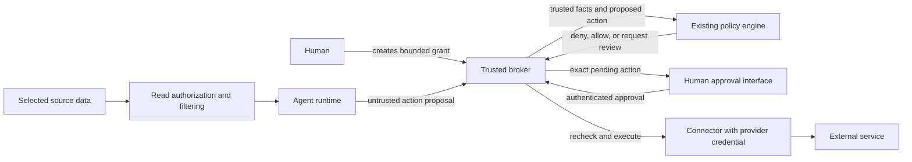

# Delegated authority for AI agents: technical investigation

Research date: 20 September 2026. Status: investigation and proposed experiment; no implementation or product decision.

**Recommendation: do not start a new general-purpose authorization library yet.** The decision model already exists in standards and policy engines, and open-source Python integrations overlap closely with the proposal. A potentially useful contribution is a small, reusable implementation of the boundary between a proposed action, an approval, and the exact operation executed. Whether that contribution deserves its own package remains unproven.

This investigation uses official specifications, project documentation, and selected source inspection. It is not a security audit or an interoperability test. “Documented” does not mean independently verified in a running deployment. Drafts, repository designs, and implemented interfaces are distinguished below. Absence from the reviewed material is not proof that a feature does not exist.

## 1. What the problem is, in backend terms

Your central concern is correct: a program that proposes operations should not acquire authority merely by proposing them convincingly. An agent can select an action; trusted application code must establish whether that action is permitted and control its execution.

This is a familiar backend separation: a **policy decision point** computes permission; a **policy enforcement point** intercepts the actual operation and applies that decision. These terms describe separate responsibilities, not necessarily separate services. [NIST terminology](https://pages.nist.gov/zero-trust-architecture/glossary.html)

| Concept | What it changes in the system |
|---|---|
| Identity | Gives the human, agent, and executing service distinct stable identifiers. An identifier alone proves nothing. |
| Authentication | Establishes which caller sent this request, using a validated credential or trusted local connection. Never accept identity from the model's tool arguments. |
| Authorization | Determines whether this caller can perform this operation on these resources now. |
| Delegation | Records that an authority holder granted a particular agent a bounded subset of authority. Naming Alice as a principal does not prove Alice delegated anything. |
| Context filtering | Controls what information enters the model, its provider, memory, and retrieval results. Reading is itself a protected operation. |
| Execution | Uses the real credentials to send, read, share, purchase, or modify something. This is where permission must become unavoidable. |

The human delegator is not necessarily the resource owner. An employee cannot delegate access beyond the employer's rules. Effective authority should be the intersection of the human's current rights, the explicit grant, the agent's own restrictions, the resource owner's policy, and the connector's scope.

The broker and connector can initially be one small service. The agent must not possess the provider credential, alter the policy or approval records, or invoke an equivalent unguarded connector. A Python wrapper in a trusted tool host can constrain a misled model. It cannot constrain arbitrary malicious Python running in that same process with access to its secrets. Protecting against a compromised runtime needs an actual isolation boundary: separate identity/process or container, protected storage, and restricted routes to capabilities.

There is an existing practical example of this architecture: GitHub Agentic Workflows runs agent work with read-only permissions and processes structured action requests in separate jobs with write permissions. This supports the feasibility of the pattern, without providing a general email/delegation library. [GitHub safe outputs](https://github.github.com/gh-aw/reference/safe-outputs/)

### Corrections to the initial model

**A label is not necessarily an access boundary.** Gmail's `labelIds` filters a list request; its general read scope remains mailbox-wide. An agent holding that credential can omit the filter. A trusted broker can enforce label restrictions, but then the broker still holds broad upstream authority. A dedicated mailbox populated with selected copies can reduce that upstream exposure further. [Gmail scopes](https://developers.google.com/workspace/gmail/api/auth/scopes), [message-list parameters](https://developers.google.com/workspace/gmail/api/reference/rest/v1/users.messages/list)

**Read-only is still consequential.** Recovery links, medical details, and tax records may already have been disclosed once included in a hosted model's input. A send-email gate cannot undo that exposure. Local inference changes the data-processing trust boundary; it does not restrict what the local agent may read or execute.

**“Data being disclosed” cannot simply be a model-supplied field.** The executor must resolve document identifiers to trusted metadata and immutable content. A request saying `classification="public"` is not evidence. After a model sees a secret, preventing every paraphrase, encoding, or indirect disclosure through otherwise permitted output is a much harder information-flow problem.

**“Purpose” is useful metadata, but weak authority on its own.** A model can claim every request is “for insurance shopping.” Enforce observable constraints such as approved providers, fixed form fields, specific document versions, amounts, and expiry. Assessing the real intent of arbitrary text remains outside a small deterministic gate.

**Approval is a workflow, not a third kind of execution permission.** Both `DENY` and `REQUIRE_APPROVAL` mean “do not execute now.” Approval must lead to a fresh check of a specific stored action. A hard prohibition should not become overridable merely because the agent asks a human repeatedly.

**A signed grant does not create a boundary.** A signature proves provenance/integrity under its trust assumptions. The executor must still verify scope, current validity, and request binding, and the agent must have no alternate execution route.

## 2. Four realistic end-to-end examples

These are illustrative policies, not claims about what every provider API supports. In each case, `ALLOW` permits the trusted connector to attempt the operation; it does not guarantee provider success. Every denial and execution result is recorded without copying unnecessary sensitive content into logs.

### Insurance-shopping agent

- **Context:** a user-reviewed form with location, vehicle characteristics, coverage preferences, and renewal date; selected current-policy fields. No general inbox, recovery messages, or tax archive.
- **Request:** submit those exact fields to a named insurer for a quote.
- **Evaluation:** valid grant for this agent and task; approved insurer endpoint; allowed fields; number of submissions; expiry; whether submission also authorizes marketing, a credit inquiry, or a contractual commitment. These effects need connector-specific definitions.
- **ALLOW:** the connector constructs and sends the permitted quote request. It does not let the agent choose arbitrary URLs or additional fields.
- **DENY:** an unapproved recipient or attachment is rejected before disclosure. A malicious quote page cannot expand the grant.
- **Human approval:** sharing a newly requested document, permitting a credit inquiry, accepting specified terms, or purchasing the policy. Show the actual recipient, data, price, and terms/version. Buying insurance is a separate capability from requesting a quote.

### Email assistant

- **Context:** selected message snapshots and an approved address book. If access uses a label, the broker checks each message and attachment rather than trusting a client-side list filter.
- **Request:** send a response to a known accountant with one approved document version.
- **Evaluation:** authenticated agent/delegator; mailbox; all actual recipients including CC/BCC; body and attachment snapshot; current document disclosure rules; grant expiry; send quota; approval requirement.
- **ALLOW:** send a preapproved low-risk template to a permitted contact with no extra attachments.
- **DENY:** reject `attacker@example.com`, a prohibited tax document, a substituted attachment, or a forged approver field. Reject before using the send credential.
- **Human approval:** display and approve the complete non-template message and attachments. Any subsequent edit invalidates that approval. Even an approved recipient does not make arbitrary sensitive content safe.

### Calendar assistant

- **Context:** free/busy intervals and working-hour preferences; event descriptions withheld unless needed.
- **Request:** create a 30-minute meeting with specified attendees, time zone, title, visibility, and notification behavior.
- **Evaluation:** allowed calendar; attendee identities; duration; availability; working hours; external attendees; content exposure; whether invitations will actually be sent. An event can disclose information even though it is “just calendar access.”
- **ALLOW:** create a permitted internal meeting in an available slot.
- **DENY:** reject a private calendar, unauthorized attendees, prohibited hours, or an attempt to expose private descriptions.
- **Human approval:** external invitations or a schedule conflict that policy explicitly permits the owner to override. Recheck availability on execution; a calendar can change while approval is pending.

### Purchasing agent

- **Context:** an approved shopping list, product information, budget, and delivery-address reference. Payment credentials stay with the executor.
- **Request:** purchase a particular SKU, quantity, merchant, total amount, currency, and delivery destination.
- **Evaluation:** merchant identity; full amount including tax/shipping; recurring versus one-time purchase; allowed category; remaining aggregate budget; current quote; expiry; delivery destination. Budget must be reserved atomically so simultaneous requests cannot each spend the same balance.
- **ALLOW:** execute an eligible purchase within the remaining autonomous budget using a provider idempotency mechanism where available.
- **DENY:** reject an unapproved merchant, over-budget total, prohibited subscription, or changed destination.
- **Human approval:** a purchase above the autonomous threshold but within an explicitly approvable ceiling. A changed price requires re-evaluation and, when approval-bound fields change, new approval. Approval of one charge must not authorize repeated charges.

## 3. What already exists

The strongest overlaps and their practical limits are compared below. “Controls” means that the technology can participate in a correctly integrated boundary; no policy library makes an alternate credential or execution path disappear.

### Standards and general authorization components

These components are not AI-specific. Each can govern both reads and writes when the resource server or trusted adapter performs the check. None filters model context after the data has already reached the model.

| Existing mechanism and level | Delegated authority and approval | Enforcement, bypass, and remaining work |
|---|---|---|
| **OAuth scopes, token exchange, rich authorization requests:** credential issuance and API access. | OAuth delegates limited access. RFC 8693 can preserve a human subject and a separate acting service; RFC 9396 carries structured details such as amount and recipient. Consent at issuance is not automatically per-operation approval. | The receiving API must support and enforce the relevant restrictions. Token exchange does not inherently guarantee attenuation or cascading revocation. A wrapper is bypassable if the agent also retains a broader usable token. |
| **UMA 2.0:** resource-owner-managed access, permission tickets, and authorization assessment. | Already provides successful authorization, denial, and `request_submitted` while owner intervention is required. This is strong counterevidence to novelty of the three-way outcome. | Requires resource-server/authorization-server integration. Concrete resource definitions, approval presentation, and operation binding still need implementation. An unrelated API does not become UMA-aware through a client library. |
| **Macaroons, Biscuit, UCAN:** restricted credentials/capabilities. | Macaroons add narrowing caveats, including third-party discharge requirements. Biscuit supports signed, attenuated credentials and existing Datalog policies. UCAN supports signed capability delegation/invocation. Human-to-agent authority can be represented if the root authority is established. Approval workflow is application work. | Targets must verify the credential and trusted request facts. Applicable to read and action access, but no universal context sanitizer. Offline verification complicates immediate revocation; retaining a more powerful parent credential defeats derivative-only limits. Biscuit has Python bindings; a new grant format is unnecessary. |
| **OPA/Rego:** general policy decision engine, Apache-2.0. | Can evaluate grant/context data and return structured outcomes, including a custom review state. It does not supply the grant or approval lifecycle. | A Python client can call the Data API. Inputs, executor, and durable state remain application responsibilities. An undefined result is not permission; validate the response strictly. |
| **Cedar:** authorization language/engine, Apache-2.0. | Principal/action/resource/context and entity relationships can model the human, agent, and grant. Native decisions are allow/deny; matching forbid overrides permit. Review needs an application-level convention. | Python can use a community binding; it is not an officially supported AWS/Cedar Python SDK. The caller enforces decisions. Evaluation diagnostics matter: an erroneous policy can be skipped rather than causing the whole request to fail. |
| **AuthZEN:** interoperable interface between policy decisions and enforcement. | Final Authorization API 1.0 uses subject/action/resource/context and a boolean result. The separate approval profile adds a requestable denial and subsequent re-evaluation. | It standardizes communication, not policy storage or the executor. A false decision remains non-executable. Approval and protocol mappings are extensions, with draft status described below. |

Sources for the table: [OAuth 2.0](https://www.rfc-editor.org/rfc/rfc6749.html), [token exchange](https://www.rfc-editor.org/rfc/rfc8693.html), [rich authorization requests](https://www.rfc-editor.org/rfc/rfc9396.html), [UMA 2.0](https://docs.kantarainitiative.org/uma/wg/rec-oauth-uma-grant-2.0.html), [Macaroons paper](https://www.ndss-symposium.org/wp-content/uploads/2017/09/04_3_1.pdf), [Biscuit](https://doc.biscuitsec.org/getting-started/introduction), [Biscuit Python](https://github.com/eclipse-biscuit/biscuit-python), [UCAN specifications](https://github.com/ucan-wg/spec), [OPA integration](https://www.openpolicyagent.org/docs/integration), [Cedar semantics](https://docs.cedarpolicy.com/auth/authorization.html), [Cedar Python binding](https://github.com/k9securityio/cedar-py), [AuthZEN final specification](https://openid.net/specs/authorization-api-1_0.html).

The distinction between standards and proposals matters here. AuthZEN Authorization API 1.0 is final, dated 11 January 2026. Its **Access Request and Approval Profile is Draft 1, dated 17 September 2026**. The draft already addresses request substitution, approval binding, expiry, and fresh evaluation after approval; it intentionally leaves the approval service/UI implementation open. It is useful design input, not proof of widespread deployed interoperability. The working group also lists draft COAZ protocol mappings, including MCP. [Approval draft](https://openid.github.io/authzen/authzen-access-request-approval-profile-1_0.html), [official specification status](https://openid.net/wg/authzen/specifications/)

There is also relevant IETF work, but “OAuth for agents” is not one settled standard. Transaction Tokens is an active OAuth working-group draft; the Attenuated Delegation Profile for Automated Agents is an individual draft. The often-cited On-Behalf-Of User Authorization for AI Agents draft is expired in the checked snapshot. None should be presented as an implemented universal agent-delegation protocol. [Transaction Tokens status](https://datatracker.ietf.org/doc/draft-ietf-oauth-transaction-tokens/), [attenuated-delegation status](https://datatracker.ietf.org/doc/draft-hamr-oauth-agent-delegation/), [expired on-behalf-of draft](https://datatracker.ietf.org/doc/draft-oauth-ai-agents-on-behalf-of-user/)

Sender-constrained OAuth credentials, such as DPoP, help with stolen-token misuse but do not replace operation approval: DPoP's normal proof binds the method/URI and token, not the full request body. It therefore does not itself prove approval of a particular attachment or payment amount. [OAuth security BCP](https://www.rfc-editor.org/rfc/rfc9700.html), [DPoP](https://www.rfc-editor.org/rfc/rfc9449.html)

### Identity, MCP, and agent approval frameworks

| System and level | Delegation and review | Context/action controls, bypass, and missing pieces |
|---|---|---|
| **Microsoft Entra Agent ID / Agent 365:** commercial agent identity, enterprise governance, and security ecosystem; AI-specific. | Distinct agent identities, delegated or application permissions, sponsors, lifecycle controls, and access-package approvals. | Entra/API permissions and complementary Purview/Defender controls can govern resource access and data protection. An entitlement approval is not approval of every concrete message. Fine-grained context and operation semantics still depend on the resource/integration. Alternate credentials remain outside a particular governed path. |
| **MCP authorization and interactive tools:** agent/tool protocol, not a general IAM service. | HTTP transport uses OAuth; interactive tools can request input and resume. Delegation depends on the associated authorization system. | Servers can authorize reads and actions; current continuation rules address state integrity. MCP does not make every server safe or eliminate alternate non-MCP routes. Trusted approver identity and concrete resource policy still need implementation. |
| **FastMCP:** open-source Python server authorization/middleware. | Checks can use authenticated claims and external policy; grants and approval workflow are application-defined. | Can filter discovery and check actual tool calls/resource reads. Authorization documented for authenticated HTTP is skipped for STDIO, which needs its own trust boundary. Protect every reachable endpoint. |
| **LangGraph/LangChain and Pydantic AI:** open-source AI application workflow libraries. | Existing pause/resume and conditional human-review mechanisms; delegated-human authority is supplied by the application. | Can stop wrapped read/write tool calls in a trusted runtime. They do not intrinsically isolate credentials or authorize every client-supplied approval. Context selection, trusted approval state, and execution authorization remain application work. |

Sources: [Agent ID](https://learn.microsoft.com/en-us/entra/agent-id/what-is-microsoft-entra-agent-id), [Agent 365](https://learn.microsoft.com/en-us/microsoft-agent-365/overview), [agent permissions](https://learn.microsoft.com/en-us/entra/agent-id/authorization-agent-id), [agent governance](https://learn.microsoft.com/en-us/entra/id-governance/agent-id-governance-overview), [MCP authorization, revision 2026-07-28](https://modelcontextprotocol.io/specification/2026-07-28/basic/authorization), [MCP tools](https://modelcontextprotocol.io/specification/2026-07-28/server/tools), [FastMCP authorization](https://gofastmcp.com/servers/authorization), [LangChain human review](https://docs.langchain.com/oss/python/langchain/human-in-the-loop), [Pydantic deferred tools](https://pydantic.dev/docs/ai/tools-toolsets/deferred-tools/#human-in-the-loop-tool-approval).

Microsoft's current status is more advanced than the initial background might suggest: Agent ID platform GA is recorded under April 2026; Agent 365 commercial GA began 1 May 2026. Individual features can have different availability. These products should not be dismissed as merely identity labels, but their enterprise scope does not automatically solve a personal agent's exact-email delegation needs. [Entra announcements](https://learn.microsoft.com/en-us/entra/fundamentals/whats-new#april-2026), [Agent 365 overview](https://learn.microsoft.com/en-us/microsoft-agent-365/overview)

MCP's current multi-round-trip specification is especially relevant. Client-returned state affecting authorization requires integrity protection. Principal, short expiry, and originating operation/parameter binding are recommended; when single use is required, the server must enforce it. These requirements already cover much of the proposed approval boundary at the protocol level. They do not authenticate a human merely because an agent-controlled client reports approval. [MCP multi-round-trip requests](https://modelcontextprotocol.io/specification/2026-07-28/basic/patterns/mrtr)

MCP security guidance also prohibits token passthrough and describes confused-deputy mitigations for OAuth proxies, including per-user/per-client consent. A server must validate that its token was intended for it, and use appropriate downstream credentials. A tool's name or description is not a grant. [MCP security practices](https://modelcontextprotocol.io/docs/2026-07-28/tutorials/security/security_best_practices)

Two framework details make the boundary concrete. **Pydantic AI explicitly warns that client-submitted history/approval can fabricate an approved call**, and directs authorization into the sensitive tool function. **LangGraph restarts interrupted nodes on resume**, so pre-interrupt effects may run again unless designed for replay. These are different concerns: trusting the approver and avoiding duplicate effects. [Pydantic warning](https://pydantic.dev/docs/ai/tools-toolsets/deferred-tools/#human-in-the-loop-tool-approval), [LangGraph interrupt behavior](https://docs.langchain.com/oss/python/langgraph/interrupts)

For independently deployed services, **SPIFFE/SPIRE** supplies non-AI-specific workload identity and authentication. It does not define a human's delegation, an approval state, or context filtering. That makes it a possible infrastructure dependency later, not the missing action primitive. [SPIFFE overview](https://spiffe.io/docs/latest/spiffe-about/overview/)

An existing enforcement deployment is **agentgateway**, whose MCP authorization example combines authenticated identity with CEL rules, filters discovery, and also rejects direct unauthorized calls. It can govern access to tools/resources; domain-specific grants, transaction approval, and selective message content still need policy/adapters. Its protection depends on routing relevant calls through the gateway. [agentgateway authorization example](https://github.com/agentgateway/agentgateway/blob/main/examples/mcp-authorization/README.md)

### Closest open-source Python overlaps

**apparitor — strongest small integration candidate.** Apache-2.0 and Python, with a standalone `AuthorizationEngine`, OPA/Cedar/AuthZEN backends, and adapters including FastMCP. It distinguishes user and agent checks and returns allow, block, or human review. It can guard read or action requests; selective data filtering still belongs to the adapter. The inspected FastMCP path blocks human-review calls and leaves escalation to the host; it does not implement durable approval/resume. A bypass remains wherever an operation avoids the middleware or the caller controls trusted identity inputs. It is beta and its README reports external review pending, so this is an experiment target rather than an adoption assurance. [Pinned engine](https://github.com/jhawlwut/apparitor/blob/cb64c26497ca90167409d59d5e49d222965e07e2/src/apparitor/engine.py), [pinned FastMCP adapter](https://github.com/jhawlwut/apparitor/blob/cb64c26497ca90167409d59d5e49d222965e07e2/src/apparitor/fastmcp.py), [project](https://github.com/jhawlwut/apparitor)

**Hexgate — closest direct tool-gating API.** MIT Python SDK, local operation, existing policy-engine interface, Rego/WASM option, framework wrappers, and typed allow/deny/needs-approval decisions. The shared runner checks policy and invokes an approval handler before executing a wrapped tool. Reads and writes can both be wrapped, but context selection is still tool-specific. Approval callbacks are not a complete authenticated durable approval service. Role union also differs from intersecting a human's authority with a task-specific delegated limit; delegation semantics require explicit modeling. An unwrapped tool or a compromised process with the credential can bypass this boundary. [Pinned decision interface](https://github.com/HexamindOrganisation/hexgate/blob/da41aa76e7e6a4a570976a3e9e0a5cd509dc3f54/hexgate/security/decision.py), [runner](https://github.com/HexamindOrganisation/hexgate/blob/da41aa76e7e6a4a570976a3e9e0a5cd509dc3f54/hexgate/guards/runner.py), [approval limits](https://docs.hexgate.ai/concepts/approval-required)

**Microsoft Agent Governance Toolkit — useful approval-specific contribution target.** This separate MIT open-source project must not be conflated with commercial Entra/Agent 365. It has Python action-bound approval code for expiry, action/policy/chain matching, and atomic consumption through a store interface. Crucially, the inspected package calls itself an additive migration step **not yet wired into the policy evaluator or legacy handlers**. Its in-memory reference storage is not a durable production store. Approver authentication and actual execution remain host responsibilities; this module alone controls neither context nor external actions. It is evidence that even the narrower approval idea has existing implementation work to build on. [Pinned package status](https://github.com/microsoft/agent-governance-toolkit/blob/e7f5d2bafca79e508e80a8cd7e0a6f0bb05ce197/agent-governance-python/agent-mesh/src/agentmesh/governance/approval_protocol/__init__.py), [coordinator](https://github.com/microsoft/agent-governance-toolkit/blob/e7f5d2bafca79e508e80a8cd7e0a6f0bb05ce197/agent-governance-python/agent-mesh/src/agentmesh/governance/approval_protocol/coordinator.py)

**Contribution preference:** evaluate apparitor for the engine-neutral boundary and Hexgate for ready-made tool execution/approval hooks. If durable action approval is the residual work, examine the existing Microsoft module before defining another schema. None is established by this investigation as a complete, audited replacement.

The supporting notes cover additional comparisons—OpenFGA/Cerbos for authorization, PermitRail for signed approval receipts, and Agent Control for guardrails—without treating them all as required dependencies. A recurring trap is a cooperative loop in which the agent first asks an authorization tool and then separately calls an unrestricted executor. That loop fails under the compromised-agent threat model.

Detailed evidence and implementation limits: [standards and credentials](/home/alacasse/projects/moraine/docs/research/delegation-standards-sources.md), [policy engines and OSS source snapshots](/home/alacasse/projects/moraine/docs/research/policy-overlap-sources.md), [identity, MCP, and approval frameworks](/home/alacasse/projects/moraine/docs/research/identity-mcp-approval-sources.md).

## 4. Does a new project need to exist?

The strongest case against it is that the proposed architecture is ordinary delegated authorization applied to an unreliable caller. Principal, action, resource, context, grants, and independent enforcement are established concepts. The agent's uncertainty makes narrow permissions more valuable; it does not require a new foundation for permission.

| Proposed replacement | When it is enough | What still belongs to the application |
|---|---|---|
| OAuth and existing IAM | The provider supports the needed resource/action scope, and authorization is enforced at its API. | Provider-specific transaction semantics, selective context, and safe execution/approval orchestration where scopes are coarser. |
| OPA or Cedar | The application already has a trusted executor and reliable policy inputs. | Action normalization, grant storage, approver authentication, durable pending requests, and enforcement. |
| MCP authorization/gateway | Every relevant operation crosses a protected server/gateway with sufficient policy checks. | Domain semantics and any capability accessible outside that path. |
| Agent SDK approval features | The runtime, session state, tool implementation, and approving client are trusted appropriately. | Protection from fabricated requests, compromised callers, and alternative routes. |
| Capability credentials | Every resource server verifies narrowly delegated capabilities. | Adoption by existing SaaS APIs, revocation/state, and domain-specific approval. |

**Assessment:** this should initially be an integration effort around existing primitives. A project consisting only of dataclasses and `authorize(...) -> allow/deny/review` would add another vocabulary without removing the difficult work.

The smallest plausible gap is narrower:

> A Python component, hosted inside a protected executor, that takes authenticated caller identity and a server-owned grant, binds a normalized action to durable approval state, rechecks current authority before execution, and exposes an existing policy engine through an interchangeable interface.

Its potentially reusable behavior is action binding, approval lifecycle, revocation checks, and execution correlation. Resource semantics remain adapter-specific: “send email” and “buy item” do not have interchangeable disclosure or transaction rules.

This is a **candidate integration gap**, not an established missing primitive. AuthZEN's approval work and the closest OSS projects already address pieces of it. The first contribution may be an adversarial test suite, deployment example, or small improvement to an existing project.

## 5. Smallest credible proof of concept

The following is a proposal for a later experiment. Nothing here has been implemented.

### Scope and API

Use one human, one agent, one active grant, a synthetic selected-message store, and a fake mail delivery service. Support only reading selected message snapshots and sending a bounded message. No live mailbox, real purchases, dynamic policy generation, delegation chains, custom policy language, or approval chatbot is needed.

Your four-module sketch could demonstrate policy evaluation, but it omits enforcement and pending-action state. A credible boundary needs these responsibilities, whether provided by dependencies or a few local modules:

| Responsibility | Minimum content |
|---|---|
| Models | Typed action proposal, normalized prepared action, grant, decision with reason, execution result. |
| Authority storage | Trusted grant lookup, expiry, revocation, and agent/delegator binding. |
| Policy integration | One existing engine and a strict decision mapping; missing facts and errors refuse execution. |
| Approval storage | Exact pending action, authenticated approver, expiry, and single-use execution claim. |
| Enforcement and adapter | Normalize once, evaluate, pause when required, recheck, execute the stored operation. |
| Audit | Correlate proposal, decision, approval, execution attempt, and provider outcome. |

Conceptually, the external operation is `submit(proposal, authenticated_caller)`, returning a denial, pending-request reference, or execution result. A trusted human endpoint can approve a pending reference. The executor retrieves the stored action; the agent does not submit a mutable action plus an `approved=True` flag.

An internal `authorize(prepared_action, authority_snapshot, trusted_facts)` function remains useful. It is a decision function, not a bearer permission or a substitute for the executor. The caller cannot choose arbitrary `principal`, `grant`, or “trusted” context. The host resolves these from authenticated identity and protected storage.

### Grant and action contents

A grant needs an ID, delegator, agent, resource/account boundaries, permitted operations, expiry, revocation state, and the applicable limits. Record whether an action is autonomously allowed or eligible for human review. Do not let human review override non-overridable restrictions. No subdelegation in the first experiment.

A prepared email action needs the account, all recipients, exact body, immutable attachment references/content digests, and relevant provider options. Resolve these server-side, store the normalized values, and execute those values. Do not approve a filename and later read whatever bytes happen to occupy that path.

Bind the pending request and approval to the human, authenticated agent, grant ID/version, account, prepared action, intended executor, and expiry. Record the policy version used to create it, then evaluate the current policy on resume. Possession of a pending-request ID alone must confer neither approval authority nor access to its sensitive contents.

Keep model explanations separate from authorization facts. Current time, remaining quota, document ownership/classification, and grant status come from the broker's trusted sources. Unknown attributes should not silently receive permissive defaults.

### Policy and decision handling

Start with one OPA/Rego integration, preferably through the selected existing project's supported backend. This is an existing policy language; do not invent a YAML rule language that becomes another policy engine. Cedar is also suitable, but supporting both initially would test adapter plumbing more than the suspected gap.

There is a concrete integration limitation to test: apparitor's inspected native OPA backend accepts only boolean results and supplies no advisory context for its review predicate. For this experiment, use apparitor for the authorization check, then let the trusted broker classify an authorized operation as automatic or requiring approval. If that classification is policy-driven, use a second explicitly defined boolean Rego query and fail closed on missing/error results. Do not assume the backend already transports OPA's arbitrary three-way objects. An AuthZEN adapter with an agreed review contract is another possible integration, but is unnecessary for the initial fixture. [Pinned OPA backend](https://github.com/jhawlwut/apparitor/blob/cb64c26497ca90167409d59d5e49d222965e07e2/src/apparitor/backends.py)

Use three application outcomes with explicit precedence: hard denial first, then review when allowed and required, otherwise allow. Separately represent operational failure for diagnosis, while treating it as no permission. An unavailable policy service is not a reason to ask an unqualified human to bypass policy.

If using a boolean policy API, review is an explicit additional contract, not a truthy string or an undocumented interpretation of arbitrary metadata. An allow with an obligation that the executor cannot satisfy must not execute. Avoid decision caching in the experiment.

### State, database, and cryptography

Pure evaluation needs no database. Durable approval, revocation, replay protection, and concurrent execution do need authoritative state. A single SQLite database owned by the broker is enough for a one-host experiment; PostgreSQL and a distributed queue are unnecessary initially.

Store grants; pending immutable actions; approval state and approver; execution claims/idempotency references; outcomes; and audit correlations. Protect sensitive payloads and apply retention limits. Logs should normally contain IDs, reasons, versions, and digests rather than bodies, attachments, or tokens.

No custom signed grant format is needed within this single trusted service. Use established authentication and transport protection, random unguessable request identifiers, and a standard hash for comparing immutable action contents. A hash does not authenticate its author. The protected database and authenticated endpoints supply the authority.

Signing becomes relevant if a separately administered executor must verify a grant or approval offline. At that point evaluate existing token/capability formats rather than creating cryptography. Signatures do not replace revocation or single-use state.

### Approval and revocation lifecycle

1. Authenticate the caller, load its grant, normalize the operation, and evaluate trusted facts.
2. On denial, record the reason and stop. On review, store the exact action and return a pending reference; perform no external action.
3. The human authenticates through a separate approval path and sees the actual recipients, body, and attachments. The agent cannot call that path with the human's authority.
4. Approval records one precise action and a short expiry. An edited action becomes a new request.
5. Before execution, reload grant and policy state, validate the approval/action binding, and recheck resource preconditions. A revoked grant, expired approval, or now-prohibited operation does not run.
6. Atomically claim that request for one execution attempt, with the final local grant/status check in the same transaction; associate the evaluated policy version with that claim. Record the subsequent provider outcome. A second caller cannot claim the same approval concurrently.

Revocation can initially be a broker-owned `revoked_at` value checked on every operation and resume. It prevents subsequent authorization; it cannot retract data already read or cancel an operation the provider has already accepted. Define the execution claim as the local ordering point for races between revoke and execute, and document the remaining provider-call window.

Single-use approval does **not** provide exactly-once external effects by itself. A service can crash after sending but before recording success. Use provider idempotency when available; otherwise retain an `unknown` outcome for reconciliation rather than blindly retrying. A local database transaction cannot atomically commit an email send at an unrelated provider.

### What makes enforcement unavoidable?

The agent runtime has only permission to submit proposals and read its results. Provider credentials, policy, approval storage, and execution code are owned by a different protected runtime identity. The fake provider in the experiment accepts only the broker's credential. The agent cannot access the broker's filesystem or approval channel.

Do not expose generic HTTP, shell, filesystem, or browser capabilities that recreate the forbidden operation. If arbitrary network output is available after secrets enter the model, this mail gate is not a general exfiltration boundary. A deployment claiming that stronger protection must constrain all relevant egress paths too.

For MCP, put an adapter in front of this same broker; every tool call resolves its authenticated caller and enters the same enforcement path. Tool-list filtering improves discovery but must be backed by checks on direct invocation. MCP itself need not appear in the core models.

For email, put the provider adapter behind the broker. It implements message selection, disclosure rules, exact send construction, credential custody, and provider error handling. If the provider offers only broad scopes, document that compromise of this broker can still expose those broader privileges.

## 6. Threat model for that proof of concept

Assets: selected message data, provider credential, grant/policy integrity, human approval integrity, and prevention of unauthorized external effects. Assume the OS, broker, policy engine, approver authentication, and fake provider are trusted. Treat the agent, its proposals, source messages, and tool outputs as attacker-influenced. Also test arbitrary malicious calls from the agent runtime, without assuming compromise of the trusted host.

| Threat | What the experiment can enforce | What it cannot establish |
|---|---|---|
| Prompt injection in an email | A fabricated send still crosses recipient/resource/grant checks. | Correct reasoning or detection of every malicious instruction; abuse that remains within an overbroad grant. |
| Compromised agent runtime | No provider credential, policy write access, or approval authority; direct calls remain authenticated and constrained. | Safety if the attacker also compromises the broker, its host, or the human account. |
| Malicious tool output | Output cannot manufacture authenticated identity, grant state, approval, or trusted document labels. | Truth of the tool's business content; a malicious permitted endpoint can lie. |
| Stolen credentials | A stolen broker-client credential remains bounded by that client's grant and revocation. | Direct misuse of a stolen upstream provider token outside the broker; provider-side restrictions are required. |
| Excessive permissions | Narrow explicit grants, deny by default, separate read/send scopes and ceilings. | Recovery of already disclosed data or correction of a deliberately overbroad policy. |
| Replayed authorization/approval | Server-owned action binding, expiry, atomic single-use execution claim, idempotency tracking. | Exactly-once effects at a provider lacking appropriate support. |
| Confused deputy | Bind authenticated agent, human grant, resource/account, intended executor, and operation. The service cannot use Alice's authority on Bob's request merely because Bob names Alice. | Correctness of a compromised identity provider or incorrect business ownership data. |
| Policy misconfiguration | Deny/error tests, explicit precedence, schema validation, versioned policies, audit reasons. | Proof that the configured policy expresses what the human intended. |
| Bypass attempts | Demonstrate direct-provider rejection and lack of alternate privileged tools. | All bypasses in arbitrary deployment environments or third-party adapters. |
| Substitution between approval and use | Store immutable content; compare relevant versions; execute the stored action; recheck current facts. | Atomicity across external services or undetectable changes at a malicious provider. |
| Concurrent requests and budget splitting | Atomic consumption/reservations when limits are stateful. | Unbounded multi-step harm when individually allowed actions combine in ways policy does not model. |
| Approval fatigue or misleading preview | Show executor-derived details, rate-limit requests, keep hard denials non-overridable. | Good human judgment or resistance to all social engineering. |
| Sensitive data in logs or model input | Minimize context and redact audit fields before disclosure. | General information-flow confinement once the model has secrets and an unconstrained output channel. |

The security claim to test is therefore: **within the specified deployment boundary, attacker-controlled proposals cannot make the protected executor exceed the configured grant and policy.** It is not “prompt-injection proof,” “safe agents,” or protection from every credential compromise. This investigation has not yet tested that claim.

## 7. One experiment to decide whether to contribute or create

**Run a five-engineer-day integration and falsification experiment using an existing Python authorization project, a protected broker, and a fake email service.** Start with apparitor because its standalone decision engine, existing-policy integration, and human/agent distinction most closely match the proposed seam. Treat this choice as an evaluation target, not a production endorsement. Check Hexgate's approval integration before implementing any missing approval component.

Use synthetic data and deterministic action proposals; an LLM is unnecessary because the boundary must survive deliberately malicious requests regardless of how they were generated. Drive the same broker through plain JSON requests and a thin MCP entry point to test whether the meaningful logic remains independent of that protocol. Use one policy backend and one email adapter.

The fixture has an approved contact, a selected harmless message, and an unselected synthetic tax document. Exercise legitimate allow and human-review paths, then these attacks: direct provider access; forged identity/grant; forbidden recipient including BCC; prohibited read; fabricated approval; changed body/attachment after approval; expired or revoked grant on resume; approval replay/concurrent resume; policy-engine failure; and crash after the fake provider accepts the operation.

Judge the boundary by the fake provider's observed reads and deliveries, not just the return value of `authorize()`. Every blocked case must have zero prohibited effects; the legitimate cases must still complete. Include a restart while approval is pending and a replay after restart. Record uncertainties instead of turning a passing fixture into a production security claim.

The deliverable is one runnable reference integration and a short gap report stating, for each behavior, whether it was provided by the dependency, configuration, domain-specific code, or new reusable code. Record the pinned dependency versions, extension points used, and setup effort. Stop at the timebox rather than expanding into a platform.

Decide from that one experiment:

- **Existing project plus small integration suffices:** contribute the example and adversarial tests; do not create another authorization library.
- **A reusable lifecycle gap remains and fits the existing project:** propose a focused contribution for action-bound approvals, revocation on resume, or execution correlation.
- **The dependency cannot accommodate that bounded behavior without coupling it to one runtime:** consider extracting only the demonstrated lifecycle component. Require the two entry points to share it before calling it framework-independent.
- **Almost all missing code is email semantics or deployment isolation:** publish a reference architecture/adapter, not a supposedly universal primitive.

This experiment answers the project question more directly than building a new `Principal`/`Grant`/`Decision` package and showing that it can reject one malicious prompt.
